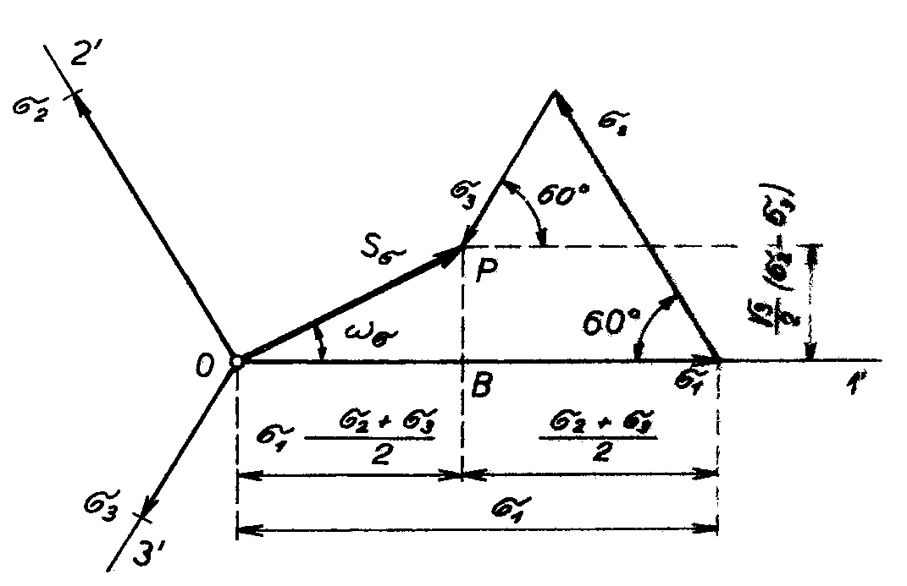

### Intenzita napätia
    
* [Poloha vektorov intenzity v stene oktaedru](intenzita_napatia/poloha_vektorov_intenzitz.md)
* [Rozbor intenzity napätia](intenzita_napatia/rozbor_intenzity_napatia.md)
* [Grafické stanovenie intenzity napätí](intenzita_napatia/graficke_tanovenie_intenzity_napatia.md)  

Intenzita napätia vyjadruje súčasný vplyv jednotlivých zložiek napäťového stavu v určitom bode telesa. Z geometrického hľadiska ide o výsledný vektor napätia, ktorý je priamo vektorovým súčtom hlavných normálnych napätí v oktaedrickej rovine. Jeho veľkosť je možné vypočítať ako z hlavných normálnych, tak aj z hlavných tangenciálnych napätí. Keďže veľkosť aj polohu vektora intenzity napätia určujeme v oktaedrickej rovine, ktorá je rovinou vektora oktaedrického tangenciálneho napätia, ide v skutočnosti o vektor intenzity tangenciálnych (šmykových) napätí.

Geometrické objasnenie vektorov intenzity tangencialných napätí je zrejmé z obr. 12.

<figure><figcaption></figcaption></figure>

Obr. 12. Grafické stanovenie tangenciálných (šmykových) napätí

 Osi $$1^{\prime}, 2^{\prime}, 3^{\prime}$$, ktoré sú projekciami hlavných osí do oktaedrálnej roviny, medzi sebou tvoria uhly $$120^{\circ}$$. Na tieto osi vynášame veľkosti hlavných normálnych napätí $$\sigma_1, \sigma_2, \sigma_3$$. Priemety napätí $$\sigma_2$ a $\sigma_3$$ v smere napätia $$\sigma_1$$ majú veľkosť

$$
\sigma_2 \cdot \cos 60^{\circ}+\sigma_3 \cdot \cos 60^{\circ}=\frac{\sigma_2+\sigma_3}{2}
$$

Ak porovnáme diagram na obr. 12 s obr. 9, ide v podstate o rovnaký postup geometrického sčítania vektorov, ktoré medzi sebou tvoria uhly $$120^{\circ}$$. V prvom prípade však, na obr. 9, boli vynesené prierezy hlavných napätí $$\sigma_1^{\prime}, \sigma_2^{\prime}, \sigma_3^{\prime}$$, čím sme ako výslednicu dostali šmykové oktaedrické napätie $$\tau_8$$. V druhom prípade, podľa obr. 12, sa v smeroch osí $$1^{\prime}, 2^{\prime}, 3^{\prime}$$ vynášajú priamo hodnoty hlavných napätí $$\sigma_1, \sigma_2, \sigma_3$$, teda hodnoty vynásobené pomerom $$\frac3{\sqrt2}$$ v porovnaní s predchádzajúcim diagramom. Výsledným vektorom príslušného geometrického súčtu vektorov $$\sigma_1, \sigma_2, \sigma_3$$ je vektor intenzity napätia $$S_\sigma$$.

Túto intenzitu je možné vypočítať ako preponu v trojuholníku $$O B P$$:
$$
\begin{aligned}
\mathcal{S}_\sigma^2 & =\left[\sigma_1-\frac{1}{2} \cdot\left(\sigma_2+\sigma_3\right)\right]^2+\left[\frac{\sqrt{3}}{2} \cdot\left(\sigma_2+\sigma_3\right)\right]^2= \\
& =\sigma_1^2+\sigma_2^2+\sigma_3^2-\left(\sigma_1 \sigma_2+\sigma_2 \sigma_3+\sigma_3 \sigma_1\right)
\end{aligned}
$$

Po úprave tohto výrazu vychádza:

$$
\begin{equation*}
S_\sigma=\sqrt{\frac{1}{2}\left[\left(\sigma_1-\sigma_2\right)^2+\left(\sigma_2-\sigma_3\right)^2+\left(\sigma_3-\sigma_1\right)^2\right]} \tag{2.21}
\end{equation*}
$$

Ak porovnáme túto rovnicu s rovnicou (2.15), ktorá vyjadruje tangenciálne oktaedrické napätie, vychádza nám vzťah medzi veličinami $$S_\sigma$$ a $$\tau_8$$ :

$$
\begin{equation*}
S_\sigma=\frac{3}{\sqrt{2}} \cdot \tau_8 \tag{2.22}
\end{equation*}
$$

To znamená, že v diagramu na obr. 12 je aj výsledný vektor intenzity napätia, t. j. úsečka $$\overline{O P}$$, zväčšený oproti analogickej veličine na obr. 9 v rovnakom pomere $$\frac{3}{\sqrt{2}}$$ ako veličiny v smeroch 1, 2, 3.
Z rovnice (2.21) vyplýva veľkosť intenzity napätia v závislosti od hlavných tangenciálnych napätí v tvare:

$$
\begin{equation*}
S_\sigma \quad \sqrt{2 \cdot\left(\tau_1^2+\tau_2^2+\tau_3^2\right)} \tag{2.22a}
\end{equation*}
$$

Túto intenzitu možno vypočítať aj z redukovaných hlavných normálnych napätí. S ohľadom na rovnice (2.19) a (2.14) vyplýva nasledujúci vzťah:

$$
\begin{equation*}
S_\sigma=\sqrt{\frac{3}{2} \cdot\left(s_1^2+s_2^2+s_3^2\right)} \tag{2.22b}
\end{equation*}
$$

Z hľadiska plasticity a podľa uvedených spôsobov matematického vyjadrenia určuje intenzita napätia veľkosť deformačného odporu častice materiálu voči zmene tvaru. Intenzita napätia, ktorá podľa rovnice (2.22) charakterizuje účinok šmykových napätí, vyjadruje tým podmienky deformácie, za ktorých dochádza k zmene tvaru.

Intenzitu napätia možno vypočítať aj pre všeobecný prípad napätia, ak zohľadníme energetické podmienky plastickej deformácie. Analytické riešenie tejto úlohy je uvedené v ďalšej časti knihy „Mechanické podmienky plasticity“ v rámci tzv. energetickej podmienky, ktorá je podmienkou stálosti intenzity napätia. Rovnica na výpočet tejto intenzity má tento všeobecný tvar:

$$
\begin{equation*}
s_0 \quad \sqrt{\frac{1}{2} \cdot\left[\left(\sigma_x-\sigma_y\right)^2+\left(\sigma_y-\sigma_y\right)^2+\left(\sigma_x-\sigma_x\right)^2\right]+3 \cdot\left(\tau_{x y}^2+\tau_{y z}^2+\tau_{z x}^2\right)} \tag{2.23}
\end{equation*}
$$

Ak majú $$\tau_{x y} \tau_{y z}, \tau_{x x}$$ nulové hodnoty, čo je prípad hlavných normálových napätí vychádza pre intenzitu napätia z rovnice (2.23) výraz (2.21).