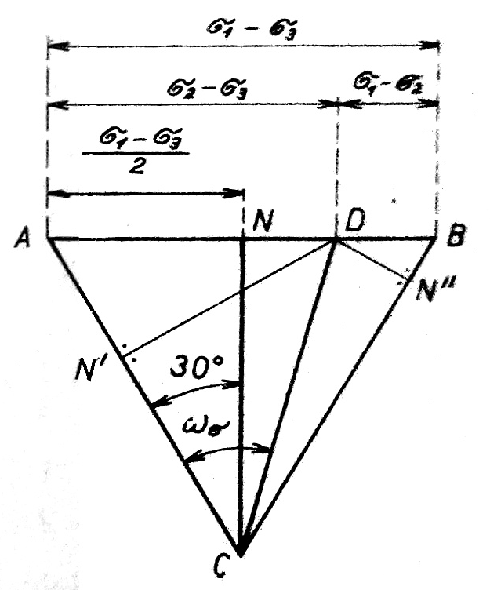

#### Grafické stanovenie intenzity napätia

V. M. Rozenberg vypracoval metódu grafického stanovenia intenzity napätia a jeho smerového uhla, ktorú možno dobre spojiť s grafickým znázornením vzťahov medzi napätiami v známom Mohrovom diagrame. Pri geometrickom sčítaní v súradnicovom systéme 1, 2, 3 na oktaedrálnej rovine vytvárajú vektory zložiek napätia uhol $$60^{\circ}$$. Ich smernice tvoria rovnostranný trojuholník.

Vytvorme teda rovnostranný trojuholník $$\overline{A B C}$$, ktorého strany majú dĺžku $$\left(\sigma_1-\sigma_3\right)$$ (obr. 14):

<figure><figcaption></figcaption></figure>

Obr. 14. Grafické stanovenie intenzity napätia

$$
\overline{A B}=\overline{B C}=\overline{C A}=\sigma_1-\sigma_3
$$

Bod $$N$$ rozdeluje stranu $$\overline{A B} \cdot \overline{N C}$$ je výškou trojuholníka, ktorá zviera so stranou $$\overline{A C}$$ i so stranou $$\overline{B C}$$ uhol $$30^{\circ}$$.

Strana $$\overline{A B}$$ je v Mohrovom diagrame osou hlavných napätí. Bodu $$B$$ zodpovedá najväčšie napätie $$\sigma_1$$, bodu $$A$$ najmenšie napätie $$\sigma_3$$ a určitému bodu $$D$$ na tejto strane napätie $$\sigma_2$$. Potom

$$
\overline{A B}=\sigma_1-\sigma_3=\overline{A D}+\overline{D B}=\left(\sigma_2-\sigma_3\right)+\left(\sigma_1-\sigma_2\right)
$$

Spojnica $$\overline{D C}$$ vymedzuje so stranou $$\overline{A D}$$ smerový uhol $$\omega_\sigma$$.

Z trojuholníka vyplýva:

$$
\begin{aligned}
& \overline{N B}=\overline{A N}=\frac{1}{2} \cdot\left(\sigma_1-\sigma_3\right) \\
& \overline{N D}=\overline{A D}-\overline{A N}=\left(\sigma_2-\sigma_3\right)-\frac{1}{2}\left(\sigma_1-\sigma_3\right)= \\
& =\frac{1}{2} \cdot\left(\sigma_2-\sigma_3\right)-\frac{1}{2} \cdot\left(\sigma_1-\sigma_2\right)
\end{aligned}
$$

$$
\begin{aligned}
& \overline{C B}^2-\overline{N B}^2=\left(\sigma_1-\sigma_3\right)^2-\frac{1}{4} \cdot\left(\sigma_1-\sigma_3\right)^2= \\
& =\frac{1}{2} \cdot\left(\sigma_1-\sigma_3\right)^2+\frac{1}{4} \cdot\left(\sigma_1-\sigma_3\right)^2
\end{aligned}
$$

Pretože

$$
\frac{1}{4}\left(\sigma_1-\sigma_3\right)^2=\left[\frac{1}{2}\left(\sigma_1-\sigma_2\right)+\frac{1}{2}\left(\sigma_2-\sigma_3\right)\right]^2
$$

je možné písať:

$$
\begin{aligned}
& \overline{C D}^2=\frac{1}{2} \cdot\left(\sigma_1-\sigma_2\right)^2+\left[\frac{1}{2} \cdot\left(\sigma_1-\sigma_2\right)+\frac{1}{2} \cdot\left(\sigma_2-\sigma_3\right)\right]^2+ \\
& +\left[\frac{1}{2} \cdot\left(\sigma_2-\sigma_3\right)-\frac{1}{2} \cdot\left(\sigma_1-\sigma_2\right)\right]^2
\end{aligned}
$$

Po vyčistení a úprave dostaneme tieto vzťahy:

$$
\begin{aligned}
& \overline{C D}^2=\frac{1}{2} \cdot\left(\sigma_1-\sigma_3\right)^2+\frac{1}{2} \cdot\left(\sigma_1-\sigma_2\right)^2+\frac{1}{2} \cdot\left(\sigma_2-\sigma_3\right)^2= \\
& =\frac{1}{2} \cdot \overline{A B}^2+\frac{1}{2} \cdot \overline{D B}^2+\frac{1}{2} \cdot \overline{A D}^2
\end{aligned}
$$

Z tohoto geometrického vzťahu vychádza dĺžka úsečky  $$C D$$ :

$$
\overline{C D}-\sqrt{\frac{1}{2}\left[\left(\sigma_1-\sigma_2\right)^2+\left(\sigma_2-\sigma_3\right)^2+\left(\sigma_3-\sigma_1\right)^2\right]}
$$

Tento výraz sa zhoduje s rovnicou (2.21) a určuje teda (v zvolenom meradle) veľkosť intenzity napätia.

Poloha bodu $$D$$ určuje druh napäťového stavu.

Úsek

$$
\begin{aligned}
& \overline{N D}=\frac{1}{2}\left(\sigma_2-\sigma_3\right)-\left(\sigma_1-\sigma_2\right)=\sigma_2-\frac{\sigma_1+\sigma_3}{2} \\
& \overline{N B}=\frac{1}{2}\left(\sigma_1-\sigma_3\right)
\end{aligned}
$$

takže ich pomer, t. j. poloha bodu $$D$$, sa dá vyjadriť výrazom

$$
\frac{\overline{N D}}{\overline{N B}}=\frac{\sigma_2-\frac{\sigma_1+\sigma_3}{2}}{\frac{\sigma_1-\sigma_3}{2}}=\frac{2 \sigma_2-\sigma_1-\sigma_3}{\sigma_1-\sigma_3}=\nu_\sigma
$$

Ak je bod $$D$$ vľavo od stredu $N$, úsek $$N D$$ treba považovať za záporný.
Pri jednoduchom ťahu platí $$\sigma_2=\sigma_3$$ a bod $$D$$ sa zhoduje s bodom $$A$$. Ukazovateľ napätia má v tomto prípade hodnotu

$$
v_d-\frac{2 \sigma_2-\sigma_1-\sigma_2}{\sigma_1-\sigma_2}=-1
$$

Pri jednoduchom tlaku, ak $$\sigma_2=\sigma_1$$, bod $$D$$ sa zhoduje s bodom $$B$$ a ukazovateľ napätia má hodnotu

$$
v_\sigma=\frac{2 \cdot \sigma_1-\sigma_1-\sigma_3}{\sigma_1-\sigma_3}
$$

Pri jednoduchom šmyku sa bod $$D$$ zhoduje so stredom $$N$$ a ukazovateľ napätí má nulovú hodnotu, ak $$\sigma_2=\frac{1}{2}\left(\sigma_1+\sigma_3\right)$$ :

$$
v_\sigma=\frac{2 \cdot \frac{1}{2}\left(\sigma_1+\sigma_3\right)-\sigma_1 \cdots \sigma_3}{\sigma_1-\sigma_3}=0
$$

Z grafického znázornenia intenzity napätia podľa obr. 14 je možné odvodiť aj vzorce pre hlavné normálne napätia vo vzťahu k intenzite napätia a k hydrostatickému tlaku.

Hydrostatický tlak, ako vieme, sa rovná zápornému hodnote oktaedrického (stredového) napätia:

$$
p=-\frac{\sigma_1+\sigma_2+\sigma_3}{3}
$$

Podľa obr. 14 sa dĺžka úseku $$\overline{N D}$$ rovná

$$
\begin{aligned}
& \overline{N D}=\sigma_2-\frac{\sigma_1+\sigma_3}{2}=\frac{3}{2} \sigma_2-\frac{\sigma_1+\sigma_2 \div \sigma_3}{2} \\
& =\frac{3}{2}\left(\sigma_2+p\right)
\end{aligned}
$$

Z geometrického vzťahu plynie:

$$
\overline{N D}=\overline{C D} \cdot \sin 2 N C D=S_\sigma \cdot \sin <N C D
$$

Porovnaním s vyššie uvedeným vzťahom dostaneme:

$$
\begin{aligned}
& \frac{3}{2}\left(\sigma_2+p\right)=S_\sigma \cdot \sin \Varangle N C D \\
& \sigma_2=\frac{2}{3} \cdot S_\sigma \cdot \sin \Varangle N C D-p
\end{aligned}
$$

Pretože uhol $$N C D=\omega_\sigma-30^{\circ}$$, je možné písať výraz pre $$\sigma_2$$ v tvare:

$$
\sigma_2=\frac{2}{3} \cdot S_\sigma \sin \left(\omega_\sigma-30\right)-p
$$

Teraz nakreslíme z bodu $$D$$ kolmice jednak na $$\overline{A C}$$, jednak na $$\overline{B C}$$. Dostaneme body $$N^{\prime}$$ a $$N^{\prime \prime}$$.

Z geometrických vzťahov vychádza:

$$
\begin{aligned}
\overline{C N^{\prime}} & =\overline{C A}-\overline{N^{\prime} A}=\overline{C A}-\overline{A D} \cdot \cos 60^{\circ}= \\
& =\sigma_1-\sigma_3-\frac{\sigma_2-\sigma_3}{2}=\sigma_1-\frac{\sigma_1+\sigma_2}{2} \\
\overline{C N^{\prime \prime}} & =\overline{C B}-\overline{D B} \cdot \cos 60^{\circ}=\sigma_1-\sigma_3-\frac{\sigma_1-\sigma_2}{2}= \\
& =\frac{\sigma_1+\sigma_2}{2}-\sigma_3
\end{aligned}
$$

Úsečky $$\overline{C N}^{\prime}$$ a $$\overline{C N^{\prime \prime}}$$ možno určiť aj vo vzťahu k úsečke $$\overline{C D}$$, ktorá vyjadruje intenzitu napätia:

$$
\begin{aligned}
& \overline{C N^{\prime}}=\overline{C D} \cdot \cos \Varangle \overline{A C D}=\mathcal{S}_\sigma \cdot \cos \omega_\sigma \\
& \overline{C N}^{\prime \prime}=\overline{C D} \cdot \cos \Varangle \overline{D C B}=\mathcal{S}_\sigma \cdot \cos \left(60^{\circ}-\omega_\sigma\right)
\end{aligned}
$$

Z týchto vzťahov vyplývajú nasledujúce výrazy pre hlavné normálne napätia:

$$
\begin{aligned}
& \sigma_1-\frac{\sigma_2+\sigma_3}{2}=\frac{3}{2}\left(\sigma_1+p\right)=S_\sigma \cdot \cos \omega_\sigma \\
& \sigma_1=\frac{2}{3} S_\sigma \cdot \cos \omega_\sigma-p \\
& \frac{\sigma_1+\sigma_2}{2}-\sigma_3=-\frac{3}{2}\left(\sigma_3+p\right)=S_\sigma \cdot \cos \left(60^{\circ} \cdots \omega_\sigma\right) \\
& \sigma_3=-\frac{2}{3} S_\sigma \cdot \cos \left(60^{\circ}-\omega_\sigma\right)-p
\end{aligned}
$$

Takto sme odvodili sústavu troch rovníc pre hlavné normálne napätia v závislosti od intenzity napätia a jej smerového uhla, ako aj od hydrostatického tlaku:

$$
\left.\begin{array}{l}
\sigma_1=\frac{2}{3} \cdot S_\sigma \cdot \cos \omega_\sigma-p  \tag{2.27}\\
\sigma_2=\frac{2}{3} \cdot S_\sigma \sin \left(\omega_\sigma-30^{\circ}\right)-p \\
\sigma_3=-\frac{2}{3} \cdot S_\sigma \cdot \cos \left(60^{\circ}-\omega_\sigma\right)-p
\end{array}\right\}
$$

Dĺžka úsečky $$C D$$, t. j. veľkosť intenzity napätia, sa mení s uhlom $$\omega_\sigma$$. Pri hodnotách $$\omega_0 \quad 0$$ a $$\omega_\sigma \quad 60^{\circ}$$ sa dĺžka úsečky $$\overline{C D}$$ rovná strane trojuholníka $$\overline{A C}=\overline{B C}$$. V tomto prípade má intenzita napätia najväčšiu hodnotu.

$$
S_{\sigma \max }=\sigma_1-\sigma_3
$$

Pri uhle $$\omega_\sigma \quad 30^{\circ}$$ sa dĺžka úsečky $$\overline{C D}$$ rovná výške $$\overline{C N}$$. V tomto prípade má intenzita napätia najmenšiu hodnotu

$$
\begin{array}{ll}
S_{\sigma \min } & \left(\sigma_1-\sigma_3\right) \cdot \sin 60^{\circ}=\frac{\sqrt{3}}{2} \cdot\left(\sigma_1-\sigma_3\right) \\
S_{\sigma \min } & \frac{\sigma_1-\sigma_3}{1,155}
\end{array}
$$

Z geometrického znázornenia je zrejmé, že uhol $$\omega_\sigma$$ sa môže meniť v rozmedzí od 0 do $$60^{\circ}$$. Pritom sa intenzita napätia mení od jedného maxima $$S_{\sigma \max }=\left(\sigma_1-\sigma_3\right)$$ po minimum $$S_{\sigma \min }=\frac{\sqrt{3}}{2} \cdot\left(\sigma_1-\sigma_3\right)$$ pri $$\omega_\sigma=30^{\circ}$$ a ďalej opäť k maximu $$S_{\sigma \max }=\left(\sigma_1-\sigma_3\right)$$.
Tieto teoretické poznatky pomerne dobre súhlasia s experimentálne zistenými hodnotami a majú významný význam pre energetické podmienky plasticity.