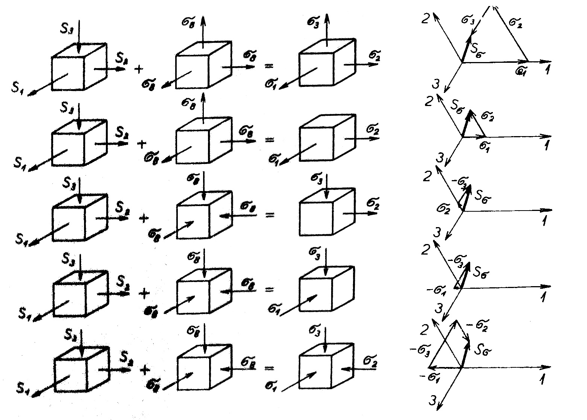

#### Rozbor intenzity napätia

Vykonáme analýzu matematických výrazov pre intenzitu napätia.
V prípade jednoduchého ťahu, ako prípadu jednoosového napätia, platí: $$\sigma_1>0, \sigma_2= =\sigma_3=0$$. Intenzita tangenciálnych napätí sa potom vyjadrí z rovnice (2.21) vzťahom:

$$
S_\sigma=\sigma_1
$$

To znamená, že v tomto prípade priamo veľkosť intenzity napätia určuje príslušné ťahové napätie. Jeho priestorovú orientáciu určuje uhol $$\omega_\sigma$$, ktorého kosínus podľa rovnice (2.24) vychádza

$$
\cos \omega_\sigma=\frac{2 \sigma_1}{2 \sigma_1}=1, \quad \text { tj. } \quad \omega_\sigma=0
$$

Vektor intenzity napätia má smer napätia $$\sigma_1$$.
Podobný je prípad jednoduchého tlaku. V tomto prípade platí $$\sigma_1<0, \sigma_2=\sigma_3=0$$ a intenzita napätia

$$
S_\sigma=\sigma_1
$$

Aj v tomto prípade sa intenzita napätia rovná príslušnému tlakovému napätiu. Smer vektora tejto intenzity:

$$
\cos \omega_\sigma=\frac{-2 \sigma_1}{2 \sigma_1}=-1, \text { tj. } \omega=180^{\circ}
$$

Tento vektor má rovnaký smer ako vektor tlakového napätia $$-\sigma_1$$.

Pri jednoduchom šmyku je jedno z hlavných normálnych napätí rovné nule, napr. $$\sigma_2=0$$, a ostatné dve hlavné napätia sú rovnako veľké, ale majú opačné znamienka, $$\sigma_1=-\sigma_{8, \text { s }}$$ Intenzita napätia sa rovná: 

$$
S_\sigma=\sqrt{\sigma_1^2+\sigma_3^2-\sigma_1 \cdot \sigma_3}=\sigma_1 \cdot \sqrt{3}
$$

Smerový uhol vektorov intenzity napätia je:

$$
\begin{aligned}
& \cos \omega_\sigma=\frac{2 \sigma_1+\sigma_3}{\sqrt{\sigma_1^2} \overline{+\sigma_3^2-\sigma_1 \sigma_3}}= \pm \frac{\sqrt{3}}{2} \\
& \omega_\sigma=30^{\circ} \mathrm{a} 210^{\circ}
\end{aligned}
$$

Pri rovinnom napätí, s ktorým sa pri riešení úloh plastického tvárnenia kovov často stretávame, je jedno hlavné napätie, napr. $$\sigma_3$$, rovné nule a z ostatných dvoch je jedno ťahové napätie, napr. $$\sigma_1$$, a druhé tlakové napätie, napr. $$\sigma_2$$. Ak platí $$\left|\sigma_1\right| \neq\left|\sigma_2\right|$$, vyplýva z toho nasledujúca rovnica pre intenzitu napätia:

$$
S_\sigma=\sqrt{\sigma_1^2+\sigma_2^2-\sigma_1} \cdot \overline{\sigma_2}
$$

Smerový uhol tejto intenzity je:

$$
\cos \omega_\sigma=\frac{2 \sigma_1+\sigma_2}{\sqrt{\sigma_1^2+\sigma_2^2-\sigma_1 \cdot \sigma_2}}
$$

Z rovníc (2.21), ktoré vyjadrujú veľkosť intenzity napätia, a (2.26), ktorá určuje polohu jej vektora v oktaedrickej rovine, je zrejmé, že tak veľkosť intenzity, ako aj jej smer závisia od rozdielu hlavných normálnych napätí. Z toho vyplýva, že ak sa zmenia napätia $$\sigma_1, \sigma_2, \sigma_3$$ o rovnakú hodnotu, ich rozdiely sa nezmenia a veľkosť intenzity ani smerový uhol sa takisto nezmenia. K hodnotám napätí $$\sigma_1, \sigma_2, \sigma_3$$ môžeme pripočítať rovnakú kladnú hodnotu alebo od nich odpočítať rovnakú zápornú hodnotu. Tým sa síce zmení stav napätia, vyjadrený hlavnými normálnymi napätiami $i$, ale veľkosť a smer intenzity sa nezmenia.

Takáto pripočítaná alebo odpočítaná hodnota predstavuje oktédrické napätie. Zmenou oktédrického napätia je možné získať niekoľko ekvivalentných stavov napätia s rovnakými hodnotami $$S_\sigma$ a $\omega_\sigma$$, ktoré sa líšia iba hodnotou oktédrického napätia.

Na obrázku 13 je znázornených niekoľko schém napäťového stavu s rôznymi hodnotami a rôznymi znamienkami hlavných normálnych napätí $$\sigma_1, \sigma_2, \sigma_3$$. Každé z týchto napätí môžeme vyjadriť ako jednoduchý súčet redukovaných napätí $$s_1, s_2, s_3$$ a oktaedrického napätia $$\sigma_8$$. Z priložených diagramov intenzity napätia $$S_\sigma$$ v systéme priesečníkov pravouhlých osí $$1, 2, 3$$ v rovine oktaédra je zrejmé, že vo všetkých prípadoch má vektor $$S_\sigma$$ rovnakú veľkosť, smer a znamienko.

<figure><figcaption></figcaption></figure>

Obr. 13. Ekvivalentné stavy napätosti s rovnakou intenzitou napätia 
