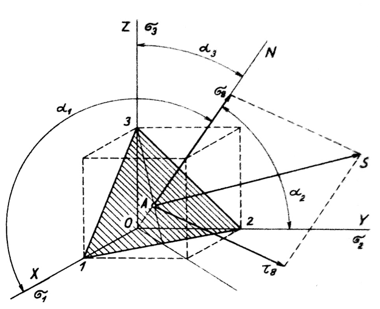

#### Objasnenie a vyjadrenie oktaedrického napätia

Ide o výsledné napätie pôsobiace v rovine oktaédra. Možno ho rozložiť na zložku, ktorá pôsobí kolmo na túto rovinu a označuje sa ako normálové oktaédrické napätie, a ďalej na zložku, ktorá leží v oktaédrickej rovine a ktorá sa označuje ako tangenciálne (šmykové) oktaédrické napätie.

Normálové oktaedrické napätie sa svojím matematickým vyjadrením rovná priemernej hodnote zložiek normálového napätia v smere súradnicových osí, a preto sa nazýva aj stredné napätie. Na každej z ôsmich plôch oktaédra má rovnakú veľkosť a jeho fyzikálny význam je teda možné prirovnať k všesmerovému hydrostatickému tlaku kvapalín. Preto sa označuje aj ako hydrostatické napätie, alebo priamo ako hydrostatický tlak, ak ide o tlakové napätie. Ak ide o ťahové napätie, označuje sa ako záporný hydrostatický tlak.

Oktaedrické napätie ako matematická veličina má svojím účinkom rovnaký vplyv ako zložky napätia v smere súradnicových osí v prípade normálových napätí alebo v súradnicových rovinách v prípade tangenciálnych napätí.

Poloha normálového oktaedrického napätia je v priestore jednoznačne určená smerom normály na plochu oktaedru. Ak je stav napätia $$\mathbf{v}$$ v bode telesa určený hlavnými normálovými napätiami $$\sigma_1, \sigma_2, \sigma_3$$, rovina oktaédra vyrezáva na súradnicových osiach $$\sigma_1, \sigma_2, \sigma_3$$ rovnako veľké úseky $$\overline{01}, \overline{02}, \overline{03}$$ (obr. 8). Normála $$N$$ tejto roviny zviera s osami súradníc rovnako veľké smerové uhly $$\alpha_1=\alpha_2=\alpha_3=\alpha$$. Keďže súčet štvorcov smerových kosínusov tejto normály sa rovná jednému,

<figure><figcaption></figcaption></figure>

Obr. 8. Napätie na oktaedrickej rovine

$$
\cos ^2 \alpha_1+\cos ^2 \alpha_2+\cos ^2 \alpha_3=1
$$

vychádza veľkosť kosínusu smerového uhla:

$$
|\cos \alpha|=\frac{1}{\sqrt{3}}
$$

Tomuto kosínusu ktorého číselná hodnota je 0,57733 , zodpovedá uhol $$\alpha=54^{\circ} 44^{\prime} 12^{\prime \prime}$$.

Výsledné napätie zo zložiek $$\sigma_1, \sigma_2$$ a $$\sigma_3$$, spadajúce do smeru normály $$N$$, rovná se podľa rovnice (2.4):

$$
\begin{align*}
& \sigma_{\mathrm{okt}}=\sigma_8=\sigma_1 \cdot \cos ^2 \alpha+\sigma_2 \cdot \cos ^2 \alpha+\sigma_3 \cdot \cos ^2 \alpha \\
& \sigma_{\mathrm{okt}} \equiv \sigma_8=\frac{\sigma_1+\sigma_2+\sigma_3}{3} \tag{2.14}
\end{align*}
$$

Z tohto odvodenia a matematického vyjadrenia je zrejmé, že čo sa týka veľkosti, normálne oktaedrické napätie sa rovná aritmetickému priemeru troch hlavných normálových napätí $$\sigma_1, \sigma_2, \sigma_3$$. Preto je označenie stredné normálové napätie úplne oprávnené. Hodnoty hlavných napätí v rovnici (2.14) je potrebné dosadiť s ohľadom na ich znamienko. Preto môže mať stredné normálové napätie ako zápornú hodnotu (hydrostatický tlak), tak aj kladnú hodnotu (záporný hydrostatický tlak).

Z hľadiska plastického správania a podľa spôsobu matematického vyjadrenia určuje normálne oktaedrické napätie veľkosť deformačného odporu častice materiálu pri zmene objemu. Všestranný rovnomerný ťah alebo tlak, ako je vyjadrený oktaedrickým napätím, môže vyvolať len takú deformáciu, pri ktorej sa objem zmení, t. j. zväčší alebo zmenší.

Ak porovnáme výraz (2.14) s výrazom (2.9), vidíme, že oktaedrické (stredné) normálne napätie je tretinou lineárneho invariantu $\Delta_1$. Keďže ide o invariantnú veličinu, nezávislú od orientácie súradníc, veľkosť normálneho oktaedrického napätia možno vyjadriť aj ako aritmetický priemer všeobecných zložiek normálnych napätí $$\sigma_{\mathrm{x}}, \sigma_{\mathrm{y}}, \sigma_{\mathrm{z}}$$ :

$$
\begin{equation*}
\sigma_{\mathrm{okt}} \equiv \sigma_8=\frac{\sigma_1+\sigma_2+\sigma_3}{3}=\frac{\sigma_{\mathrm{x}}+\sigma_{\mathrm{y}}+\sigma_{\mathrm{z}}}{3} \tag{2.14a}
\end{equation*}
$$

Druhou zložkou výsledného napätia na ploche osemstenu 1-2-3 (obr. 8) je osemstenové tangenciálne (šmykové) napätie. Jeho veľkosť určíme z rovnice (2.5):

$$
\begin{aligned}
\tau_{\mathrm{oltc}}^2=\tau_{\mathrm{s}}^2 & =\sigma_1^2 \cdot \cos ^2 \alpha+\sigma_2^2 \cdot \cos ^2 \alpha+\sigma_3^2 \cdot \cos ^2 \alpha- \\
& -\left(\sigma_1 \cdot \cos ^2 \alpha+\sigma_2 \cdot \cos ^2 \alpha+\sigma_3 \cdot \cos ^2 \alpha\right)^2 \\
\tau_8^2 & =\frac{2}{9}\left[\sigma_1^2+\sigma_2^2+\sigma_3^2-\left(\sigma_1 \sigma_2+\sigma_2 \sigma_3+\sigma_3 \sigma_1\right)\right]
\end{aligned}
$$

Po vyčistení a úprave dostávame rovnicu:

$$
\begin{equation*}
\tau_{\mathrm{okt}}=\tau_8=\frac{1}{3} \cdot \sqrt{\left(\sigma_1-\sigma_2\right)^2+\left(\sigma_2-\sigma_3\right)^2+\left(\sigma_3-\sigma_1\right)^2} \tag{2.15}
\end{equation*}
$$

Odstránením dvojčlenu pod odmocninou a ich úpravou dostávame výraz

$$
2 \cdot\left(\sigma_1+\sigma_2+\sigma_3\right)^2-6 \cdot\left(\sigma_1 \sigma_2+\sigma_2 \sigma_3+\sigma_3 \sigma_1\right)
$$

Prvý člen tohto výrazu predstavuje podľa rovnice (2.9) dvojnásobok štvorca lineárneho invariantu napätia a druhý člen podľa rovnice (2.10) šesťnásobok kvadratického invariantu napätia. Preto môžeme rovnicu (2.15) pre tangenciálne oktaedrické napätie zapísať aj v tvare:

$$
\begin{equation*}
r_{\text {okt }} r_8=\frac{1}{3} / 2 A_1^2 \cdots 6 A_2 \tag{2.16}
\end{equation*}
$$

Ak porovnáme rovnicu (2.15) s rovnicou (2.12), zistíme, že súčet štvorcov rozdielov hlavných normálnych napätí je

$$
\left(\sigma_1-\sigma_2\right)^2+\left(\sigma_2-\sigma_3\right)^2+\left(\sigma_3-\sigma_1\right)^2
$$

sa rovná štvornásobku súčtu štvorcov hlavných tangenciálnych napätí

$$
4 .\left(\tau_1^2+\tau_2^2+\tau_3^3\right)
$$

Ak tento výraz dosadíme do rovnice (2.15), dostaneme vzťah medzi tangenciálnym oktaedrickým napätím a zložkami hlavných tangenciálnych napätí:

$$
\begin{equation*}
\tau_{\mathrm{okt}} \equiv \tau_8=\frac{2}{3} \sqrt{\tau_1^2-\tau_2^2+\tau_3^2} \tag{2.17}
\end{equation*}
$$

Pri výpočte tangenciálneho oktaedrického napätia z rovnice (2.15) je potrebné dosadiť hlavné normálne napätia s ohľadom na ich znamienko.