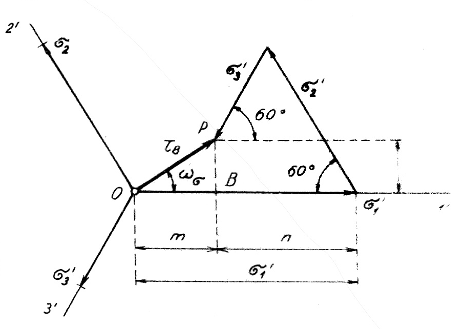

#### Oktaedrické napätie v cylindrických súradniciach

Doterajšie metódy určovania veľkosti oktaedrických napätí sa týkali skúmania napätia v ortogonálnych súradniciach. Názorné je riešenie tejto úlohy aj v cylindrických súradniciach.

Cylindrické súradnice $$[z, r, \varphi]$$ zvolíme tak, aby sa ich os $$Z$$ zhodovala s normálou oktaedrickej roviny prechádzajúcej počiatkom ortogonálneho súradnicového systému. Tým sa táto os zhoduje s vektorom $$\sigma_8$$. Potom je oktaedrická rovina rovinou parametrov $$r, \varphi$$ valcového súradnicového systému. Keďže v tejto rovine leží oktaedrické tangenciálne napätie $$\tau_8$$, stotožníme parameter $$r \mathrm{~s}$$ s týmto napätím. Parameter $$\varphi$$ bude označovať veľkosť uhla $$\omega_\sigma$$, ktorý zviera oktaedrické napätie $$\tau_8$$ s premietnutím niektorej ortogonálnej osi na plochu oktaedru. Valcové súradnice budú potom mať označenie $$\sigma_8, \tau_8, \omega_\sigma$$.

Priamky $$1^{\prime}, 2^{\prime}, 3^{\prime}$$ osi ortogonálneho súradnicového systému $$1 \equiv \sigma_1, 2 \equiv \sigma_2, 3 \equiv \sigma_3$$ zvierajú v oktaédrickej rovine uhly $$120^{\circ}$$ (obr. 9).

<figure><figcaption></figcaption></figure>

Obr. 9. Priemety hlavných normálových napätí do oktaedrickej roviny

Na určenie projekcií hlavných normálnych napätí $$\sigma_1, \sigma_2, \sigma_3$$ v smere osí $$1^{\prime}, 2^{\prime}, 3^{\prime}$$ je potrebné poznať smerové kosínusy uhlov, ktoré zviera oktaedrická rovina, t. j. jej normála, so súradnicovými osami $$1,2,3$$ a so súradnicovými rovinami $$1-2,2-3,3-1$$. So súradnicovými osami zviera uhol so smerovým kosínusom $$\frac{1}{\sqrt{3}}$$, so súradnicovými osami uhol so smerovým kosínusom $$\sqrt{\frac{2}{3}}$$. Prezentácie $$\sigma_1, \sigma_2, \sigma_3$$ je potrebné vypočítať ako prezentácie vektorov síl na súradnicových rovinách, pričom veľkosť oktaedrickej roviny sa rovná jednotke. Veľkosti projekcií hlavných napätí $$\sigma_1, \sigma_2, \sigma_3$$ do smerov $$1^{\prime}, 2,3^{\prime}$$ sa preto určia zo vzťahov:

$$
\begin{aligned}
& \sigma_1^{\prime}=\frac{1}{\sqrt{3}} \cdot \sqrt{\frac{2}{3}} \cdot \sigma_1-\frac{\sqrt{2}}{3} \cdot \sigma_1 \\
& \sigma_2^{\prime}=\frac{1}{\sqrt{3}} \cdot \sqrt{\frac{2}{3}} \cdot \sigma_2=\frac{\sqrt{2}}{3} \cdot \sigma_2 \\
& \sigma_3^{\prime}=\frac{1}{\sqrt{3}} \cdot \sqrt{\frac{2}{3}} \cdot \sigma_3=\frac{\sqrt{2}}{3} \cdot \sigma_3
\end{aligned}
$$

Vektorový súčet zložiek $$\sigma_1^{\prime}, \sigma_2^{\prime}, \sigma_3^{\prime}$$ dáva výsledný vektor, ktorý leží v oktaedrickej rovine a je teda vektorom tangenciálneho oktaedrického napätia. Grafické znázornenie vektora $$\tau_8$$ je uvedené na obr. 9.

Podľa obrázku 9 sa oktaedrické šmykové napätie $\tau_8$ vypočíta ako prepona v trojuholníku OBP:

$$
\begin{aligned}
& \tau_8^2=\overline{O P^2}=m^2+l^2 \\
& m=\sigma_1^{\prime}-\left(\sigma_2^{\prime} \cdot \cos 60^{\circ}+\sigma_3^{\prime} \cos 60^{\circ}\right)=\sigma_1^{\prime}-\frac{\sigma_2^{\prime}+\sigma_3^{\prime}}{2} \\
& l=\sigma_2^{\prime} \cdot \sin 60^{\circ}-\sigma_3^{\prime} \cdot \sin 60^{\circ}=\frac{\sqrt{3}}{2} \cdot\left(\sigma_2^{\prime}-\sigma_3^{\prime}\right)
\end{aligned}
$$

Po dosadení týchto výrazov do vyššie uvedenej rovnice dostaneme výraz pre štvorcové oktédrické šmykové napätie v tvare:

$$
\tau_8^2=\left[\sigma_1^{\prime}-\frac{\sigma_2^{\prime}+\sigma_3^{\prime}}{2}\right]^2+\left[\frac{\sqrt{3}}{2} \cdot\left(\sigma_2^{\prime}-\sigma_3^{\prime}\right)\right]^2
$$

Jeho úpravou dostaneme rovnicu:

$$
\tau_8=\sqrt{\sigma_1^{\prime 2}+\sigma_2^{\prime 2}+\sigma_2^{\prime 2}-\left(\sigma_1^{\prime} \sigma_2^{\prime}+\sigma_2^{\prime} \sigma_3^{\prime}+\sigma_3^{\prime} \sigma_1^{\prime}\right)}
$$

Ak dosadíme za $$\sigma_1^{\prime}, \sigma_2^{\prime}, \sigma_3^{\prime}$$ hodnoty $$\frac{\sqrt{2}}{3} \cdot \sigma_1$$ atď., dostaneme konečný tvar rovnice pro $$\tau_N$$ :

$$
\begin{aligned}
& \tau_\kappa \quad \frac{1}{3} \sqrt{2\left[\sigma_1^2+\sigma_2^2+\sigma_3^2-\left(\sigma_1 \sigma_2+\sigma_2 \sigma_3+\sigma_3 \sigma_1\right)\right]} \\
& \tau_{\mathrm{K}} \quad \frac{1}{3} \sqrt{\left(\sigma_1-\sigma_2\right)^2+\left(\sigma_2-\sigma_3\right)^2+\left(\sigma_3-\sigma_1\right)^2}
\end{aligned}
$$

Táto rovnica, odvodená na základe grafického riešenia, je zhodná s rovnicou (2.15), ktorá bola odvodená analyticky. Tým sa potvrdzuje správnosť grafického riešenia podľa obr. 9.

Uhol $$\omega_\sigma$$ je podľa obr. 9 vztiahnutý k ose $$1^{\prime}$$, ale rovnako by bolo možné previesť riešenie vzhľadom k osiam $$2^{\prime}$$ alebo $$3^{\prime}$$.

Veľkosť uhla $$\omega_\sigma$$ určíme pomocou dotyčnice:
$$
\begin{align*}
& \operatorname{tg} \omega_\sigma=\frac{l}{m}=\frac{\frac{\sqrt{3}}{2}\left(\sigma_2^{\prime}-\sigma_3^{\prime}\right)}{\sigma_1^{\prime}-\frac{\sigma_2^{\prime}+\sigma_3^{\prime}}{2}}=\frac{\frac{13}{2}\left(\sigma_2-\sigma_3\right)}{\sigma_1-\frac{\sigma_2+\sigma_3}{2}} \\
& \operatorname{tg} \omega_\sigma=\frac{\sqrt{3} \cdot\left(\sigma_2-\sigma_3\right)}{2 \sigma_1-\left(\sigma_2+\sigma_3\right)} \tag{2.18}
\end{align*}
$$

V tomto prípade sa smerový uhol $$\omega_\sigma$$ vypočíta z veľkosti hlavných normálnych napätí. Je však možné ho určiť aj pomocou kosínusu, a to vo vzťahu k intenzite napätia, ako bude uvedené ďalej.

Ak teraz poznáme veľkosti oktaedrických napätí a smer tangenciálnej zložky, týmto spôsobom je jednoznačne určené napätie v oktaedrickej rovine v závislosti od hlavných normálnych napätí. Rovnica (2.14) určuje veľkosť normálneho oktaedrického napätia, $z$ rovnice (2.15) alebo (2.17) je možné vypočítať veľkosť tangenciálneho, t. j. šmykového oktaedrického napätia a z rovnice (2.18) sa vypočíta veľkosť uhla, ktorým sa určí poloha tangenciálneho oktaedrického napätia v oktaedrickej rovine.