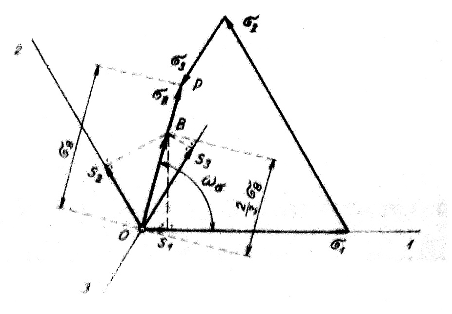
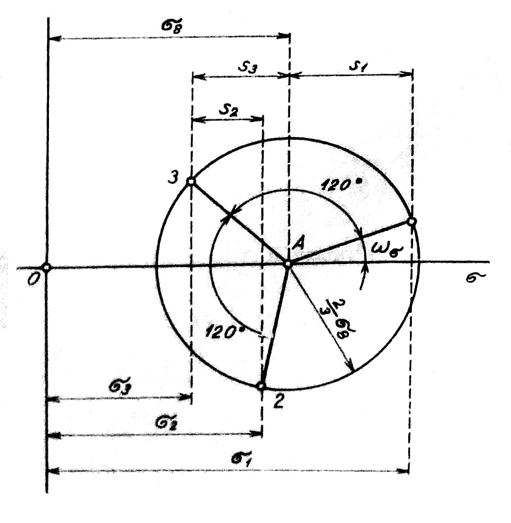

### Redukované napätia

Redukované napätie je rozdiel medzi hlavným normálovým napätím v uvažovanom smere a stredným, t. j. normálovým oktaedrickým napätím. Redukované normálové napätia sú teda vektory napätia v smere hlavných osí, ktorých veľkosť je daná rozdielom medzi veľkosťou hlavného normálového napätia a normálového oktaedrického napätia. Ako bude vysvetlené v ďalšej kapitole, sú to zložky deviátora napätia.

Podľa tejto definície možno pre redukované normálové napätie zapísať tieto matematické výrazy:

$$
\left.\begin{array}{l}
\left|s_1\right|=\left|\sigma_1\right|-\sigma_8  \tag{2.19}\\
\left|s_2\right|=\left|\sigma_2\right|-\sigma_8 \\
\left|s_3\right|=\left|\sigma_3\right|-\sigma_8
\end{array}\right\}
$$

Ak vezmeme do úvahy rovnicu (2.14), sústava rovníc (2.19) spĺňa zrejmú identitu:

$$
\begin{equation*}
s_1+s_2+s_3=0 \tag{2.20}
\end{equation*}
$$

Platí teda, že súčet redukovaných normálových napätí sa rovná nule. Ide o podobný vzťah, ktorý platí pre tangenciálne napätia. Preto je možné vo výpočtoch namiesto redukovaných normálnych napätí použiť hlavné tangenciálne napätia, pre ktoré platia rovnice (2.12) a (2.13).

Ak do rovníc (2.19) dosadíme pre oktaedrické normálne napätie výraz (2.14), dostaneme rovnice pre redukované napätia v tomto tvare:

$$
\begin{aligned}
& s_1=\frac{2}{3}\left[\sigma_1-\frac{1}{2}\left(\sigma_2+\sigma_3\right)\right] \\
& s_2=\frac{2}{3}\left[\sigma_2-\frac{1}{2}\left(\sigma_3+\sigma_1\right)\right] \\
& s_3=\frac{2}{3}\left[\sigma_3-\frac{1}{2}\left(\sigma_1+\sigma_2\right)\right]
\end{aligned}
$$
Výrazy v zlomkových zátvorkách sa rovnajú pravouhlým projekciám napätia $\sigma_8$ na súradnicové osi 1, 2, 3 v oktaedrickej rovine:
$$
\begin{aligned}
& \sigma_1-\frac{1}{2}\left(\sigma_2+\sigma_3\right)=\sigma_8 \cdot \cos \omega_\sigma \\
& \sigma_2-\frac{1}{2}\left(\sigma_3+\sigma_1\right)=\sigma_8 \cdot \cos \left(\omega_\sigma-120^{\circ}\right) \\
& \sigma_3-\frac{1}{2}\left(\sigma_1+\sigma_2\right)=\sigma_8 \cdot \cos \left(\omega_\sigma-240^{\circ}\right)
\end{aligned}
$$

Závislosť zložiek redukovaných napätí od oktaedrických napätí možno potom vyjadriť týmito rovnicami:
$$
\begin{aligned}
& s_1=\frac{2}{3} \cdot \sigma_8 \cdot \cos \omega_\sigma \\
& s_2=\frac{2}{3} \cdot \sigma_8 \cdot \cos \left(\omega_\sigma-120^{\circ}\right) \\
& s_3=\frac{2}{3} \cdot \sigma_8 \cdot \cos \left(\omega--240^{\circ}\right)
\end{aligned}
$$

Tieto výrazy použijeme ako základ pre grafické určenie redukovaných napätí v oktaedrickej rovine (obr.10).

<figure><figcaption></figcaption></figure>

Obr. 10. Grafické stanovenie redukovaných napätí

Úsečka $\overline{O P}$ znázorňuje oktaedrické napätie $\sigma_s$. Pravoúhle prierezy dvoch tretín tohto úseku, $\overline{O B}=\frac{2}{3} \overline{O P}$, na súradnicových osiach $1,2,3$, priamo udávajú veľkosť redukovaných napätí $s_1, s_2, s_3$.

T. Pelczynský použil uvedené vzťahy pre redukované napätia na zostavenie „polárneho diagramu redukovaných napätí“. Tento diagram, znázornený na obr. 11, označovaný tiež ako „hviezdicový diagram napätí“, určuje priamo pre dané hlavné napätia $\sigma_1, \sigma_2, \sigma_3$ nielen veľkosti redukovaných napätí, ale aj smerový uhol $\omega_\sigma$ oktaedrických napätí. Diagram zostavíme tak, že zo stredu $A$, ktorého vzdialenosť od počiatku súradníc $O$ je $\overline{O A}=\sigma_8$, opíšeme kružnicu s polomerom $\frac{2}{3} \cdot \sigma_8$. Súradnice v koncových bodoch $\sigma_{1,} \sigma_{2,} \sigma_3$ pretínajú túto kružnicu v bodoch $1,2,3$, ktoré určujú veľkosti $s_1, s_2, s_3$ a uhol $\omega_\sigma$.

<figure><figcaption></figcaption></figure>

Obr. 11. Hviezdicový diagram napätí
