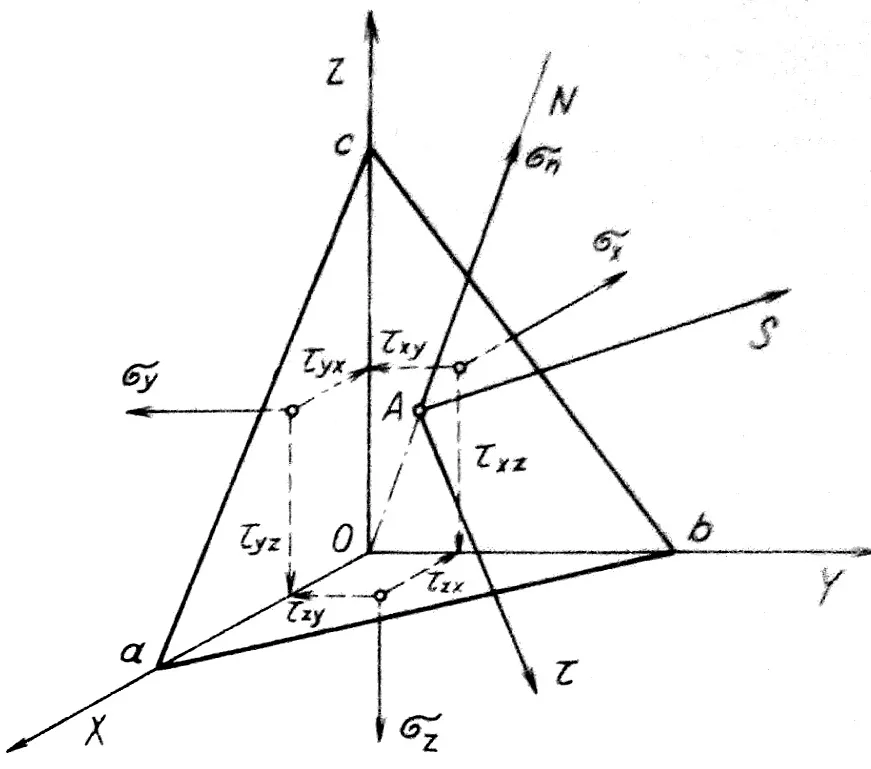
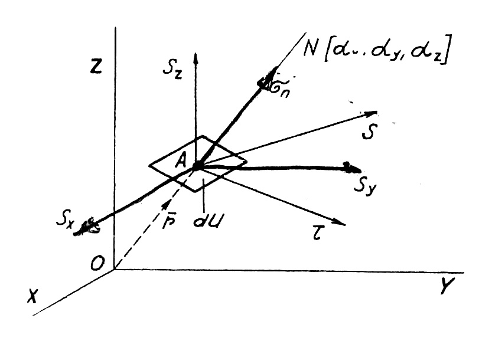

# Obecný stav napätosti tvárneného telesa

Všeobecný stav napätosti telesa materiálu sa v bode sa vzhľadom na ľubovoľnú rovinu prechádzajúcu týmto bodom. Na určenie polohy zvoleného bodu a roviny v priestore môžeme použiť rôzne súradnicové systémy: karteziánsky, valcový alebo sférický. Riešenia v týchto rôznych súradnicových systémoch sú ekvivalentné, ale líšia sa svojím matematickým vyjadrením. Spravidla volíme súradnice, ktoré podľa technologickej povahy tvárniaceho procesu poskytujú najilustratívnejšie a najjednoduchšie matematické vyjadrenie a riešenie. Napríklad pre kovanie medzi paralelnými plochými kovadlinami je vhodné použiť karteziánske súradnice, pre extrudovanie vo valcovom extrudéri valcové súradnice a pre ťahanie v kužeľovej matrici sférické súradnice.\
V dalším bude uveden způsob vyjádření obecného stavu napjatosti v ortogonálních souřadnicích.\
V oblasti plastických deformácií, ako aj v oblasti elastických deformácií, ktoré zohľadňujú pružnosť a pevnosť, je možné v ľubovoľnom bode telesa určiť všeobecný stav napätia  pomocou troch zložiek vektorov normálneho napätia $$\sigma_x, \sigma_y, \sigma_z$$ a šiestimi zložkami tangenciálnych (šmykových) napäťových vektorov $$\tau_{xy}, \tau_{yx}, \tau_{yz}, \tau_{zy}, \tau_{zx}, \tau_{xz}$$. Združené tangenciálne napätia  $$\tau_{xy}$$ a $$\tau_{yx}$$ atď. sú rovnaké čo do veľkosti. Preto môžeme pre vyjadrenie stvu napätosti uvažovať len s tromi zložkami napätia: $$\tau_{xy}, \tau_{yz}, \tau_{zx}$$. Obecný stav napätosti je teda definovaný šiestimi zložkami napätia.\
Pokiaľ je stav napätia rovnaký vo všetkých bodoch materiálu telesa alebo tvárneného objemu, tento stav označujeme ako stav homogénneho napätia. Takýto stav zvyčajne existuje len v jednoduchých prípadoch zaťaženia telesa a zvyčajne len v oblasti elastických a malých plastických deformácií. Príkladom je napätie v skúšobnej tyči počas ťahovej skúšky; pokiaľ sa tyč miestami nezúži, nevytvorí sa známy „krčok“. Vo všeobecnosti sa však napätia v jednotlivých bodoch materiálu telesa líšia veľkosťou a priestorovou orientáciou. Ide potom o nehomogénny stav napätia.\
V ľubovoľnej rovine v karteziánskom súradnicovom systéme $$X, Y, Z$$, ktorá pretína bod telesa, v ktorom skúmame napätie, zložky normálového a tangenciálneho napäťového vektora dávajú výsledné normálne napätie $$\sigma$$ a výsledné tangenciálne napätie $$\tau$$ (obr. 6). 

<figure><figcaption></figcaption></figure>

Obr. 6. Zložky napätia v bode telesa

Táto rovina vytvára v pravouhlých súradniciach trojuholník $$a,b,c$$ ktorý je jednou stenou štvorstenu. Predpokladajme, že veľkosť plochy tohto trojuholníka je rovná jednej. Smerové uhly normály $$N$$ plochy trojuholníka určujú sklon zvolenej roviny k súradnicovým osiam a sú $$\alpha_x, \alpha_y, \alpha_z$$.\

Výsledné sily v uvažovanom bode telesa v smere jednotlivých súradnicových osí sú pri jednotkovej veľkosti šikmej stany štvorstena rovnaké ako napätie v danom smere.Sily v uvažovanom bode telesa teda môžu byť určené z nasledujúcich rovníc:

$$
\begin{aligned}
S_x &= \sigma_x \cos\alpha_x + \tau_{yx} \cos\alpha_y + \tau_{zx} \cos\alpha_z \\
S_y &= \tau_{xy} \cos\alpha_x + \sigma_y \cos\alpha_y + \tau_{zy} \cos\alpha_y \\
S_z &= \tau_{xz} \cos\alpha_x + \tau_{yz} \cos\alpha_y + \sigma_z \cos\alpha_z
\end{aligned}
\tag{2.1}
$$

Tento systém troch lineárnych rovníc teda predstavuje matematický výraz všeobecného stavu napätosti v bode telesa v pravouhlom súradnicovom systéme.\
Celkové napätie $$S$$ na jednotke plochy ľubovolnej roviny, preloženej zvoleným bodom telesa je dané geometrickým súčtom vektorov zložiek napätia $$S_x, S_y, S_z$$ (obr. 7). Priemet výsledného napätia $$S$$ do smeru normály $$N$$ ku zvolenej rovine sa označuje ako normálové napätia $$\sigma_n$$.

<figure><figcaption></figcaption></figure>

Obr. 7. Napätia na elementárnej ploche

Veľkosť $$\sigma_n$$ je možné vypočítať z rovnice:
$$
\sigma_{\mathrm{n}}=S_{\mathrm{x}} \cdot \cos \alpha_{\mathrm{x}}+S_{\mathrm{y}} \cdot \cos \alpha_{\mathrm{y}}+S_{\mathrm{z}} \cdot \cos \alpha_{\mathrm{z}}
$$

Pokiaľ dosadíme do tejto rovnice za zložky $S_{\mathrm{x}}, S_{\mathrm{y}}$ a $S_{\mathrm{z}}$ výrazy z rovnice (2.1), dostaneme tento vztah:
$$
\begin{aligned}
\sigma_{\mathrm{n}}= & \left(\sigma_{\mathrm{x}} \cdot \cos \alpha_{\mathrm{x}}+\tau_{\mathrm{yx}} \cdot \cos \alpha_{\mathrm{y}}+\tau_{\mathrm{zx}} \cdot \cos \alpha_{\mathrm{z}}\right) \cdot \cos \alpha_{\mathrm{x}}+ \\
& +\left(\tau_{\mathrm{xy}} \cdot \cos \alpha_{\mathrm{x}}+\sigma_{\mathrm{y}} \cdot \cos \alpha_{\mathrm{y}}+\tau_{\mathrm{zy}} \cdot \cos \alpha_{\mathrm{z}}\right) \cdot \cos \alpha_{\mathrm{y}}+ \\
& +\left(\tau_{\mathrm{xz}} \cdot \cos \alpha_{\mathrm{x}}+\tau_{\mathrm{yz}} \cdot \cos \alpha_{\mathrm{y}}+\sigma_{\mathrm{z}} \cdot \cos \alpha_{\mathrm{z}}\right) \cdot \cos \alpha_{\mathrm{z}}
\end{aligned}
$$

Po vyčíslení a úprave, při ktorých dosádzame $\tau_{\mathrm{xy}}=\tau_{\mathrm{yx}} ; \tau_{\mathrm{yz}}=\tau_{\mathrm{zy}} ; \tau_{\mathrm{zx}}=\tau_{\mathrm{xz}}$, dostaneme obecný tvar rovnice pre normálové napätia:
$$
\begin{aligned}
\sigma_{\mathrm{n}}= & \sigma_{\mathrm{x}} \cdot \cos ^2 \alpha_{\mathrm{x}}+\sigma_{\mathrm{y}} \cdot \cos ^2 \alpha_{\mathrm{y}}+\sigma_{\mathrm{z}} \cdot \cos ^2 \alpha_{\mathrm{z}}+ \\
& +2\left(\tau_{\mathrm{xy}} \cdot \cos \alpha_{\mathrm{x}} \cdot \cos \alpha_{\mathrm{y}}+\tau_{\mathrm{xz}} \cdot \cos \alpha_{\mathrm{x}} \cdot \cos \alpha_{\mathrm{z}}+\right. \\
& \left.+\tau_{\mathrm{yz}} \cdot \cos \alpha_{\mathrm{y}} \cdot \cos \alpha_{\mathrm{z}}\right)
\end{aligned}
\tag{2.2}
$$

Geometricky táto rovnica predstavuje plochu druhého stupňa pre neznáme kosínusy uhlov smeru. Túto plochu nazývame plochou napätia.

Súradnicový systém $$X, Y, Z$$ znázornený na obr. 7 možno otočiť tak, aby normála $N$ k elementárnej rovine zhodovala so smerom výsledného vektora napätia $S$. V tomto špeciálnom prípade bude v uvažovanej elementárnej rovine pôsobiť iba normálne napätie $\sigma_{\mathrm{n}}$, zatiaľ čo tangenciálna zložka napätia $$\tau$$ bude rovná nule.

Súradnicové osi s touto orientáciou sa nazývajú hlavné osi a zodpovedajúce normálne napätia v smere týchto osí sa nazývajú hlavné normálne napätia a označujú sa symbolmi $$\sigma_1, \sigma_2, \sigma_3$$.

Matematický výraz pre povrch napätia v súradnicovom systéme hlavných osí má potom tvar podľa rovnice (2.2):
$$
\begin{aligned}
\sigma_n=\sigma_1 \cdot \cos ^2 \alpha_1+\sigma_2 \cdot \cos ^2 \alpha_2+\sigma_3 \cdot \cos ^2 \alpha_3
\end{aligned}
\tag{2.3}
$$
kde $\alpha_1, \alpha_2, \alpha_3$ sú smerové uhly normály vzhľadom k hlavným osiam.
Pre zložky výsledného napätia $S_1, S_2, S_3$ v smere hlavných os vychádzajú z výrazu $(2,1)$ tieto rovnice:
$$
\left.\begin{array}{cc}
S_1 & \sigma_1 \cdot \cos \alpha_1 \\
S_2 & \sigma_2 \cdot \cos \alpha_2 \\
S_3 & \sigma_3 \cdot \cos \alpha_3
\end{array}\right\}
\tag{2.1a}
$$

Celkové napätie ne elementárnej ploche sa potom rovná:
$$
\begin{aligned}
S^2 & =S_1^2+S_9^2+S_3^2 \\
& =\sigma_1^2 \cdot \cos ^2 \alpha_1+\sigma_2^2 \cdot \cos ^2 \alpha_2 \mid \cdot \sigma_3^2 \cdot \cos ^2 \alpha_3= \\
& =\sigma_n^2 \mid \tau^2
\end{aligned}
\tag{2.4}
$$

Odtialto je možné vypočítať tangenciálne napätia zo vzťahu:
$$
\begin{aligned}
& r^2 \quad S^2 \quad \sigma_{\mathrm{n}}^2 \\
& \sigma_1^2 \cdot \cos ^2 \alpha_1+\sigma_2^2 \cdot \cos ^2 \alpha_2+\sigma_3^2 \cdot \cos ^2 \alpha_3 \\
& \quad\left(\sigma_1 \cdot \cos ^2 \alpha_1+\sigma_2 \cdot \cos ^2 \alpha_2+\sigma_3 \cdot \cos ^2 \alpha_3\right)^2
\end{aligned}
\tag{2.5}
$$

Medzi druhými mocninami kosínusov smerových uhlov platí známy vzťah z analytickej geometrie.
$$
\cos ^2 \alpha_1+\cos ^2 \alpha_2+\cos ^2 \alpha_3=1
$$

Pomocou tohto vzťahu získame z rovníc (2.1a) po ich umocnení a sčítaní nasledujúci výraz
$$
\frac{S_1^2}{\sigma_1^2}+\frac{S_2^2}{\sigma_2^2}+\frac{S_3^2}{\sigma_3^2}=\cos ^2 \alpha_1+\cos ^2 \alpha_2+\cos ^2 \alpha_3
$$

Táto rovnica predstavuje trojosový elipsoid s polosami $$\sigma_1, \sigma_2, \sigma_3$$. Ide o takzvaný napäťový elipsoid, ktorý je špeciálnym prípadom napäťových plôch v súradnicovom systéme $$S_1, S_2, S_3$$.