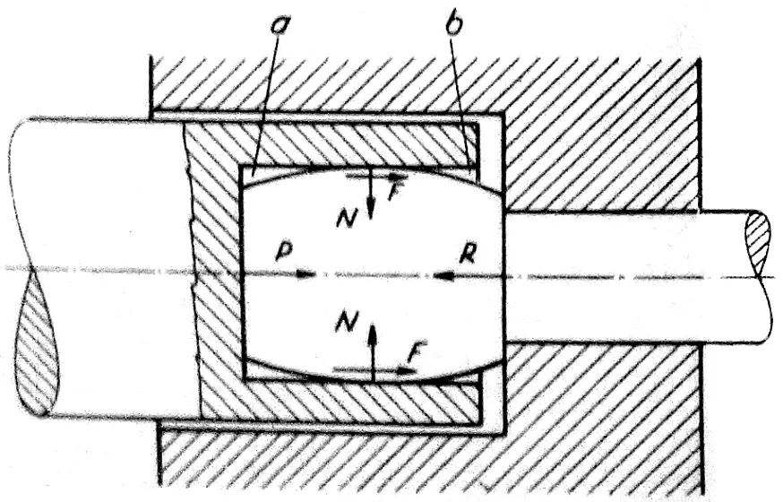

# Vonkajšie sily pri plastických deformáciách

Při technologických tvářecích pochodech, jejichž základem jsou plastické, tj. trvalé deformace, uplatňují se dva druhy vnějších sil. Jsou to jednak síly vyvolané nástrojem, jednak síly tření na dotykové ploše mezi tvářeným kovem a nástrojem. Tyto síly tření mají u některých tvářecích pochodů, např. u válcování, stejnou aktivní funkci jako síly přímo vyvozované nástrojem. U jiných tvářecích pochodů, např. při tažení v průvlaku, uplatňují se síly tření jako pasivní a k jejich překonání je třeba určité vnější tahové síly.

<figure><figcaption></figcaption></figure>

Obr. 1. Vnější síly při pěchování v matrici

<figure><figcaption></figcaption></figure>

Obr. 2. Vonkajšie sily pri pechovaní v dutine lisovniku

Z hlediska účinku vnějších sil vyvozovaných nástrojem a sil vnějšího tření na dotykové ploše členíme při deformačních procesech vnější síly na

a) aktivní vnější síly, které jsou primárními silami vyvolanými tahem nebo tlakem (nebo úderem) nástroje;


b) pasivní vnější síly vyvolané třením na dotykové ploše mezi materiálem a nástrojem. Tyto odvozené, sekundární síly mají též aktivní účinek na tvářené těleso.
\
Aktivní nebo pasivní účinek sil vnějšího tření má vliv na průběh plastické deformace. Je to zřejmo z příkladů dvou různých způsobů pěchování v uzavřené dutině. Na obrázku 1 je znázorněn případ pěchování v pevné matrici. Lisovník pěchuje výchozí válcovitý polotovar soudečkovitého tvaru. Pěchovaný materiál vyplňuje dutinu matrice a je vystaven jejímu kolmému tlaku N. Tento tlak na dotykové ploše vyvolá sílu tření
\
F = μ · N (μ je součinitel vnějšího tření), která působí proti relativnímu pohybu ma-
