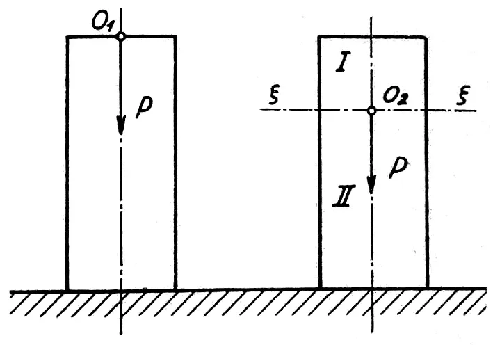
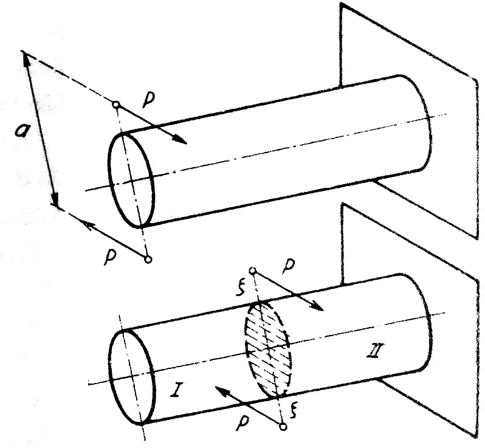
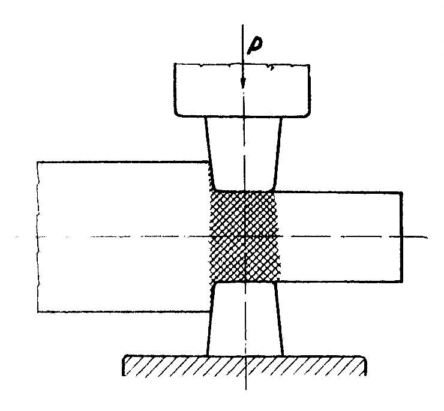

Pri tvárnení v oblasti plastického deformovania závisí účinok vonkajších síl od miesta ich pôsobenia. V mechanike pevných, dokonale tuhých telies môžeme posunúť bod pôsobenia vonkajšej sily v smere jej vektora a účinok na teleso zostane rovnaký. Pri objektoch v plastickom stave však tento bod pôsobenia nemožno posunúť v smere vektora, ani nemožno nahradiť účinok viacerých síl účinkom ich výslednice. Deformačný účinok výslednice nie je rovnaký ako účinok jednotlivých zložiek.  
Tak napríklad tlakový účinok sily $$P$$ (obr.3) na valček bude iný, ak pôsobí táto sila v bode $$O_2$$ rezu $$\xi-\xi$$, ako keď pôsobí v bode $$O_1$$ na čelnej ploche valčeku.

<figure><figcaption></figcaption></figure>

Obr. 3. Posunutie pôsobišťa vonkajšej sily

<figure><figcaption></figcaption></figure>

Obr. 4. Posunutie pôsobišta silovej dvojice

Pri jej pôsobení v bode $$O_2$$  sa časť valca $$I$$ nad rezom $$\xi - \xi$$ nedeformuje. To isté platí pre pôsobenie dvojice síl na prednú plochu valcovitého telesa a v reze $$\xi - \xi$$ (obr. 4). Ak moment dvojice síl $$P$$ pôsobí na prednú plochu, celé teleso sa skrúti, ak pôsobí v reze $$\xi - \xi$$, skrúti sa len časť $$II$$.\
Tieto zvláštnosti pôsobenia vonkajších síl na plastické teleso majú veľký význam pre pomer síl a deformácií v technologických procesoch tvárnenia. Ich výsledkom sú trvalé deformácie, ktoré sú obmedzené iba na časť objemu tvárneného telesa, ktorá je v priamom kontakte s nástrojom. Napríklad pri priečnom valcovaní valca je plastická deformácia obmedzená iba na časť objemu znázornenú na obr. 5 šrafovaním. Preto pri riešení úloh tvárnenia v oblasti plastickej deformácie zavádzame pojem „tvárnený objem“.

<figure><figcaption></figcaption></figure>

Obr. 5. Tvárnený objem

Popisované rozloženie plastického deformovania vedie k nerovnomernému deformovaniu tvárneného telesa a s tým spojenému dodatočnému vnútornému napätiu.
Veľkosť tvárneného objemu závisí od veľkosti vonkajšej sily a veľkosti kontaktnej plochy medzi materiálom a nástrojom. Preto pre dokonalé tvárnenie ovplyvňujúce celý objem materiálu nestačí zvoliť len primerane veľkú vonkajšiu silu, ale aj vhodný tvar a veľkosť nástroja, alebo tvárniť teleso v rôznych smeroch.