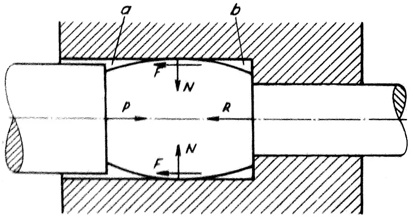
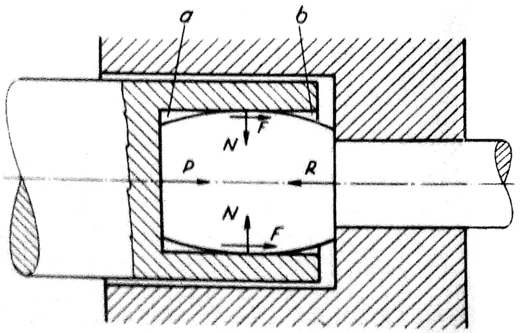

# Vonkajšie sily pri plastických deformáciách

Pri technologických tvárniacích pochodoch, ktorých základom sú plastické, tj. trvalé deformácie sa uplatňujú dva druhy vonkajších siľ. Sú  to jednak síly vyvolané nástrojom, jednak sily trenia na dotykovej ploche medzi tváreným kovom a nástrojom. Tieto sily trenia majú u niektorých trecích pochodov, ako napríklad u válcovania, rovnakú aktívnu funkciu ako sily priamo vyvodzované nástrojom. U iných tvárniacích pochodoch, napríklad ťahaní v prievlaku sa uplatňujú sily trenia ako pasívne a k ich prekonaniu je potrebné vyvodiť vonkajšiu ťahovú silu.

<figure><figcaption></figcaption></figure>

Obr. 1. Vonkajšie sily pri pechovaní v matrici

<figure><figcaption></figcaption></figure>

Obr. 2. Vonkajšie sily pri pechovaní v dutine lisovniku

Z hľadiska účinku vonkajších síľ vyvodzovaných nástrojom s síľ vonkajšieho trenia na dotykovej ploche rozdelujeme pri deformačných procesoch vonkajšie sily na:\
a) aktívne vonkajšie sily, ktoré sú primárnymi silami spôsobenými ťahaním alebo tlačením (alebo nárazom) nástroja,\
b) pasívne vonkajšie sily spôsobené trením na kontaktnej ploche medzi materiálom a nástrojom.\
Tieto odvodené sekundárne sily majú tiež aktívny vplyv na tvárnené teleso. Aktívny alebo pasívny vplyv vonkajších trecích síl ovplyvňuje priebeh plastického deformovania. To je zrejmé z príkladov dvoch rôznych metód zhutňovania v uzavretej dutine. Obrázok 1 znázorňuje prípad zhutňovania v pevnej matrici. Lis zhutňuje počiatočný valcovitý polotovar v tvare suda. Zhutnený materiál vyplňuje dutinu matrice a je vystavený jej kolmému tlaku $$N$$. Tento tlak na kontaktnej ploche spôsobuje treciu silu $$F = \mu \cdot N$$ ($$\mu$$ je koeficient vonkajšieho trenia), ktorá pôsobí proti relatívnemu pohybu materiálu, t. j. aj proti tlaku lisu $$P$$. Z podmienok rovnováhy vyplýva nasledovné v smere primárnej aktívnej sily $$P$$:

$$P = F + R$$

V tomto prípade vonkajšie trenie zvyšuje požadovanú primárnu vonkajšiu silu, čím pôsobí ako odpor.
Obrázok 2 znázorňuje ďalšiu metódu zhutňovania v dutine vytvorenej v lisovacej forme. V tomto prípade trecia sila $$F$$ opäť pôsobí proti relatívnemu pohybu tvárneného materiálu, ale smer tohto relatívneho pohybu je v súlade so smerom primárneho účinku lisovacej formy $$P$$. Sila potrebná na zhutňovanie sa odvodzuje z podmienok rovnováhy:

$$P = R - F$$

V tomto prípade vonkajšie trenie znižuje požadovanú primárnu silu a znižuje celkový odpor počas plastického deformovania.\ 
Rôzne účinky trecej sily ovplyvňujú priebeh deformácie. V prvom prípade bude predná časť dutiny $$\alpha$$ vyplnená tvárneným materiálom pomalšie a neskôr ako zadná časť $$\alpha$$. V druhom prípade naopak vonkajšie trenie prispeje k lepšiemu vyplneniu časti dutiny $$\beta$$ a časť $$\beta$$ bude vyplnená pomalšie a neskôr.  
