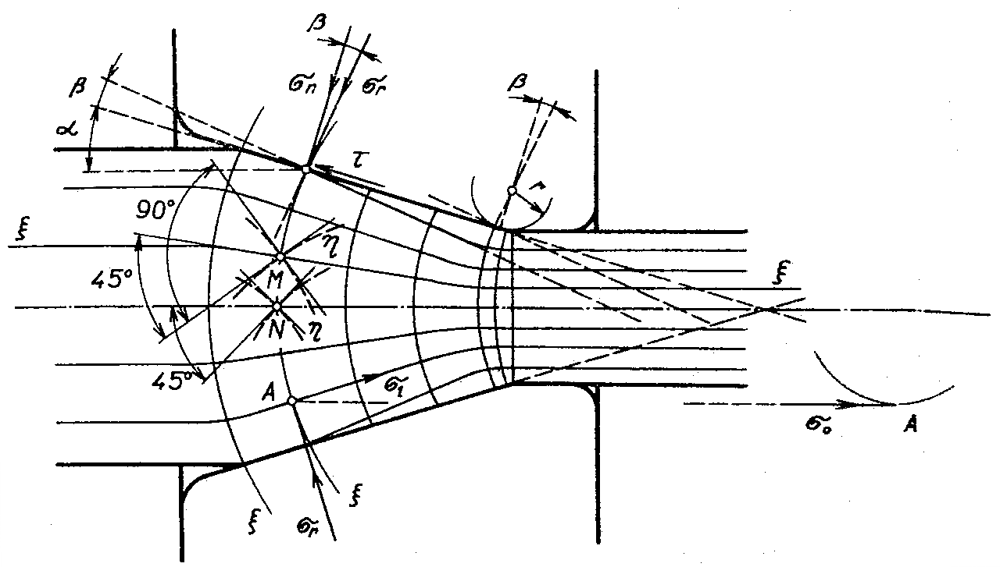

### Napätie v pásme deformácie pri ťahaní kruhovej tyče

Proces ťahania tyče kruhového prierezu je osovo symetrická deformácia, u ktorej je možné stav napätostí skúmať v pozdĺžnej osovej rovine ako prípad rovinnej deformácie a dvojosého stavu napätosti. K riešeniu takejto úlohy sa hodí metóda sklzových línií.

V pozdĺžnom osovom reze budú dva zväzky ortogonálnych trajektórií normálových $$\xi$$ napätí, a to trajektórie pozdĺžnych napätí $$\sigma_1$$ a trajektórie radiálnych napätí $$\sigma_T$$ obr. 263. Trajektórie $$\xi$$ pozdĺžnych napätí budú sledovať dráhy pozdĺžnej deformácie, tj. deformácie v smere ťahania a budú nimi preto podľa obr.259. smery vlákien v pásme deformácie, ktoré sú v smere vektorov hlavných napätí $$\sigma_1$$. V oboch voľných koncoch budú tieto trajektórie rovnobežné s osou tyče.\par    

<figure><figcaption></figcaption></figure>

Obr. 263. Ortogonálne trajektórie napätia v pásme deformácie

Keby neexistovalo vonkajšie trenie, pretínali by trajektórie radiálnych napätí ktoré sú taktiež hlavnými napätiami, obrys prievlaku pod uhlom 90°.Následkom vonkajšieho trenia sa ich smer odchyľuje od kolmice u určitý uhol. Približne sa dá predpokladať, že sa budú odkláňať od kolmici o uhol, ktorý je rovný uhlu trenia $$\beta (\mu=\tan{\beta})$$.Podľa teórie sklzových čiar môže mať uhol, ktorý zvierajú s obrysom dotykovej plochy, najväčšiu veľkosť 45°. V skutočnosti bude pri ťahaní za studena tento uhol značne menší ako 45° vzhľadom k malému súčiniteľu trenia. Trajektória radiálnych napätí pretínajú zväzok trajektórie pozdĺžnych napätí pod uhlom 90° a bude sa preto skladať z kruhových oblúkov so stredmi, ktorých predĺžené smery trajektórii $$\xi$$ sú s osou ťahané.

Trajektórie obvodových napätí $$\sigma_0$$ v rovinných rezoch kolmých na os ťahania sú nutne sústredené kružnice.

V mieste prechodu kužeľovitej časti prievlaku v cylindrickom zakončení, zaokrúhlenom polomere $r$, budú trajektórie $$\xi$$ sledovať tento obrys prievlaku. Budú prechádzať vo vodorovnej vetve kruhovými oblúkmi, ktorých polomer sa bude smerom k osi prievlaku zväčšovať. Preto budú trajektórie druhého zväzku menej zakrivené než trajektórie vychádzajúce z kužeľovitého obrysu. V mieste, kde zaokrúhlenie obrysu prievlaku končí a prechádza vo valcovitý tvar, bude už trajektória kolmá na smer osy ťahanej tyče.

Sklzové čiary, ako trajektórie hlavných tangenciálnych napätí, je možné do tohto systému ortogonálnych trajektórií normálových napätí zakresliť ako krivky prechádzajúce ich priesečníkmi a zvierajúce s nimi uhol 45°. Časť týchto kriviek je zakreslená v bodoch $M,N$.\par
Ak uvažujeme ľubovolný priesečník A ortogonálnych trajektórií. V tomto bode budú hlavné normálové napätia 
$$\sigma_1,\sigma_r,\sigma_0$$. Medzi napätiami $$\sigma_r$$ a $$\sigma_0$$ a príslušnými deformáciami $$\delta_T$$ a $$\delta_0$$ platí podľa rovnice 10.2 vzťah: $$\delta_r=\delta_0$$ ; $$\sigma_r=\delta_0$$
Ak teraz uvažujeme rovinnú napätosť s napätiami $$\sigma_1$$ a $$\sigma_r$$, je možné podľa zásad objasnených v siedmom oddiely knihy písať túto podmienku plastičnosti \ref{eq:podm_plast}:\par %7 oddiel Vypocet napatia a sil pri plastickom tvarneni kovov   

$$
\begin{align}	
	\sigma_1 -(-\sigma_r)=\sigma_K  \\
	\sigma_1+\sigma_r=\sigma_K \nonumber 
\tag{10.2}
\end{align}
$$
kde $\sigma_K$ je medza klzu.Je však nutné pamätať na to, že medza klzu sa vplyvom spevňovania materiálu tvárnením za studena v pásme deformácie mení. 