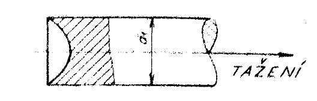
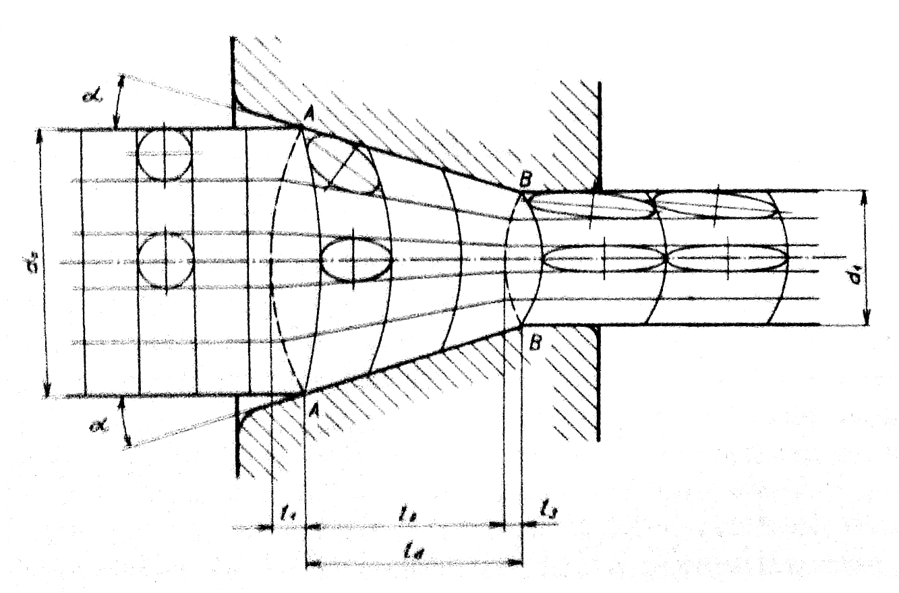
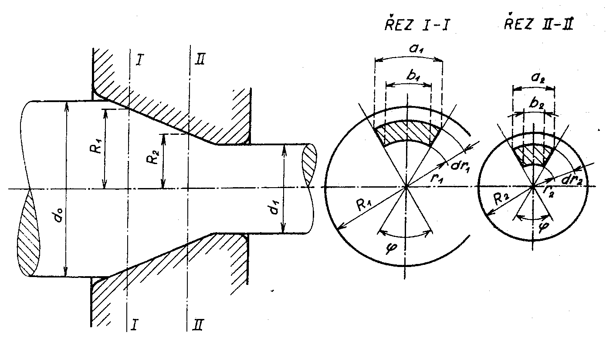

### Priebeh deformacie v prievlaku

Z prevádzkovej praxe je známe, že pôvodne rovné čelné plochy ťahanej tyče majú po ťahaní tvar znázornený na obr. 258.

<figure><figcaption></figcaption></figure>

Obr. 258. Tvar konca ťažnej tyče

Na tomto obrázku je nakreslený pozdĺžny rez, z ktorého je jasné, že povrchové vrstvy materiálu sa zpozďujú za vnútornými vrstvami. To je dôkazom nerovnomerného priebehu pozdĺžnej deformácie po výške prierezu ťahanej tyče. Veľkosť nerovnomernosti deformácie, stanovenej podľa hĺbky krátera na čelenej ploche, závisí na stupni deformácie a na veľkosti súčiniteľa trenia. Zpozďovanie povrchových vrstiev za vrstvami stredovými možno vysvetliť účinkom vonkajšieho trenia. Toto zpozdenie bude tým väčšie, čím väčší bude koeficient trenia. Vnútorné vrstvy materiálu sa v pásme deformácie pohybujú rýchlejšie ako povrchové vrstvy.
Priebeh toku materiálu v pásme deformácie je možné sledovať na Obr.259, ktorý znázorňuje deformáciu pôvodnej štvorcovej siete v pozdĺžnom reze tyče pri ťahaní. Obrázok je kreslený podľa pokusne získaných výsledkov.

<figure><figcaption></figcaption></figure>

Obr. 259. Tok materiálu v pásme deformácie

Štvorcové obrazce siete sa v pásme deformácie predlžujú a zakrivujú. Zvlášť výrazné je zakrivenie obrysov obrazcov v povrchových vrstvách. Pre názornosť sú do nedeformovaných obrazcov nakreslené kružnice, ktoré sa preťahujú do elíps, orientovaných po ťahaní svojimi dlhšími osami v smere ťahania.
Skosenie pôvodne štvorcových obrazcov a zakrivení ich strán je príznakom nehomogénnej deformácie. Tieto zmeny budú tým výraznejšie, čím bude koeficient vonkajšieho trenia väčší. Pozdĺžne risky siete sa nezakrivujú, avšak sledujú obrys nástroja. Pozdĺžne risky prebiehajú v smere vlákien tvárneného kovu. Zakrivujú sa rysky kolmo na smer ťahania, čo je dôkazom, že uprostred ťahanej tyče vzniká trvalá deformácia skôr ako v okrajových vrstvách. Hranice skutočného pásma deformácie nesúhlasia s geometrickým začiatkom tohto pásma, ktorým je rez A-A, ale tvorí ho plocha, ktorej priemet v pozdĺžnom reze tvorí na obrázku čiarkovaná krivka vychádzajúca z bodu A a je vypuklá proti zmyslu ťahania.
Vo výstupnom priereze je koniec skutočného pásma deformácie ohraničený obdobnou vypuklou plochou, ktorej obrys je na obrázku vyznačený čiarkovanou krivkou z bodov výstupného prierezu B-B.
Podľa toho sa pásmo deformácie rozpadá na tri úseky:

1. Na základný vonkajší úsek o dĺžke $$l_1$$, ktorá zaujíma časť objemu tyče, ktorý ešte nevstúpil do geometrického pásma deformácie. Veľkosť a tvar tohto úseku závisí na vstupnom priemere $$d_0$$, na kuželovitosti prievlaku $$2\alpha$$, vonkajším trením a na veľkosti úberu prierezu, teda na priemere $$d_1$$.
2. Na stredný úsek o dĺžke $$l_2$$, ktorá zaujíma väčšiu časť dĺžky $$l_d$$ geometrického pásma deformácie. Tu nastáva vlastná redukcia prierezu ťahanej tyče. Vnútorné vlákna sa pritom preťahujú rýchlejšie ako okrajové vlákna. Zadný vonkajší úsek je nutný preto, že tvorí plynulý prechod deformačnej rýchlosti medzi prierezom, kde ešte deformácia nenastáva, a prierezom A-A, kedy je deformácii vystavený celý prierez tyče. 
3.	Na predný úsek o dĺžke $$l_3$$, zaujímajúci časť objemu materiálu, ktorý je v geometrickom pásme deformácie. Tu končí redukcia prierezu ťahanej tyče a nastáva vyrovnávanie rýchlostí deformácie v jednotlivých vláknach. Ak si odmyslíme vplyv pružných deformácií, vyrovnajú sa hneď za výstupným prierezom B-B rýchlosti toku vnútorných a vonkajších vlákien.

Vzťah medzi obvodovými a radiálnymi deformáciami môžeme stanoviť nasledovne Obr. 260:

<figure><figcaption></figcaption></figure>

Obr. 260. Vzťah medzi obvodovými a radiálnymi deformáciami

Element materiálu v reze I-I pásma deformácie o stredovom uhle $$\varphi$$ má plochu obmedzenú kruhovým oblúkom $$b_1$$ o polomere $$r_1$$ a oblúkom $$a_1$$ o polomere $$(r_1+dr_1)$$. V inom priereze II-II má ten istý element opäť stredový uhol $$\varphi$$ a plochu obmedzenú oblúkom $$b_2$$ o polomere $$r_2$$ a oblúkom $$a_2$$ o polomere $$(r_2+dr_2)$$. Deformácia v radiálnom smere je určená zmenou $$dr_1$$ na $$dr_2$$ a v obvodovom smere zmenou $$a_1$ na $$a_2$$ a $$b_1$$ na $$b_2$$. Pretože uhol $$\varphi$$ pre obidve vyčiarkované plôšky rovnaký, a platí nasledovný vzťah:

$$
\begin{aligned}
	&\frac{R_1}{R2}=\frac{r_1}{r_2}=\frac{r_1+dr_1}{r_2+dr_2}=\text{konšt}=C  \\
	&\frac{dr_1}{dr_2}=C \nonumber\\
    &\frac{a_1}{a_2}=\frac{(r_1+dr_1).\varphi}{(r_2+dr_2).\varphi}=C \nonumber
\end{aligned}
$$

Z týchto vzťahov vychádza medzi pomerovými obvodovými a pomerovými radiálnymi deformáciami takáto závislosť:

Z týchto vzťahov vychádza medzi pomerovými obvodovými a pomerovými radiálnymi deformáciami takáto závislosť 

$$
\begin{aligned}
	\frac{a_1}{a_2}=\frac{dr_1}{dr_2}
	\label{eq:pomer_def}
\end{aligned}
$$

Zo vzťahu j e zrejmé, že pri ťahaní plného kruhového profilu (kruhovej tyče) sa v každom mieste tvárneného objemu stupeň deformácie v obvodovom smere (vyjadrený pomerovou deformáciou) rovná stupni deformácie v radiálnom smere. Platí teda vzájomná úmernosť obvodových a radiálnych pomerných deformácií.
Na podklade tohto zistenia je možné pre schému deformácie na obr. 256 písať vzťah $$\epsilon_2 = \epsilon_3$$ a pre schéma napätia $$\sigma_2 = \sigma_3$$. Tieto vzťahy sú typické pre ťahanie plných tyčí kruhového prierezu. Pri ťahaní plných profilov iného ako kruhového prierezu alebo ťahaní trubiek tieto vzťahy neplatia.