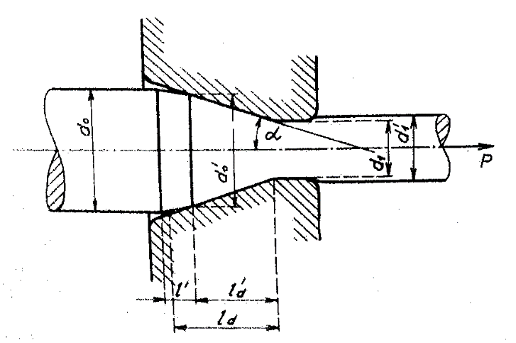
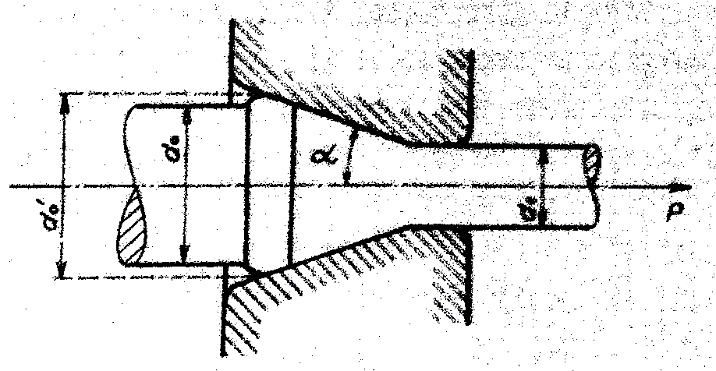

#### Pružné a plastické deformácie pri ťahaní

Pri ťahaní za studena je nutné tiež prihliadať na pružné deformácie. Majú vplyv na priebeh deformácie na počiatku pásma deformácie a prejavujú sa tiež pri výbehu tyče z prievlaku. Na počiatku pásma deformácie sa tyč deformuje najprv pružne, čím sa jej východiskový priemer $$d_0$$ zmenší na priemer $$\acute{d}_0$$ obr.261. Až potom vznikajú, ale na kratšej dĺžke $$\acute{l}_d$$ pásma plastické deformácie. Tieto deformácie sú rovnomerne rozdelené po dĺžke $$\acute{l}$$, ktorá potom o niečo menšiu kužeľovitosť, ako je kužeľovitosť prievlaku. Ide o akýsi nábeh. Ťahanej tyče do úseku pásma s plastickými deformáciami.

<figure><figcaption></figcaption></figure>

Obr. 261. Pružné deformácie pri ťahaní v prievlaku

Tento priebeh deformácie je možné predpokladať u malých uhlov $$\alpha$$ prievlaku a dostatočne pevného a pružného tvárneného materiálu.
U prievlakov s veľkou kuželovitosťou $$2\alpha$$ sa nevytvorí vplyvom pružných deformácií nábeh do úseku pásma  plastických deformácií, ale materiál sa napechuje, vstupný priemer tyče sa zväčší obr.262. Pri väčšom napechovaní vznikne plastická deformácia, pri ktorej sa vyvolá vo vytvorenom výstupku tak veľké napätie, že sa materiál potrhá.

<figure><figcaption></figcaption></figure>

Obr. 262. Napechovanie materiálu pri ťahaní

Pri výstupe z prievlaku, kedy už pôsobí jeho radiálny tlak, zmiznú pružné deformácie, ktorí sú v pásme deformácie spolu s plastickými deformáciami, čím sa priemer $$d_1$$ o niečo zväčší na priemer $$\acute{d_1}$$. Toto zväčšenie priemeru je malé a leží spravidla v prípustnom rozmedzí rozmerových odchýlok ťahanej tyče, drôtu alebo trubky. Výbehová časť valcovitej časti prievlaku sa okrem toho vyrába kužeľovitá, alebo s vybraním, poprípade s veľkým zaokrúhlením. 