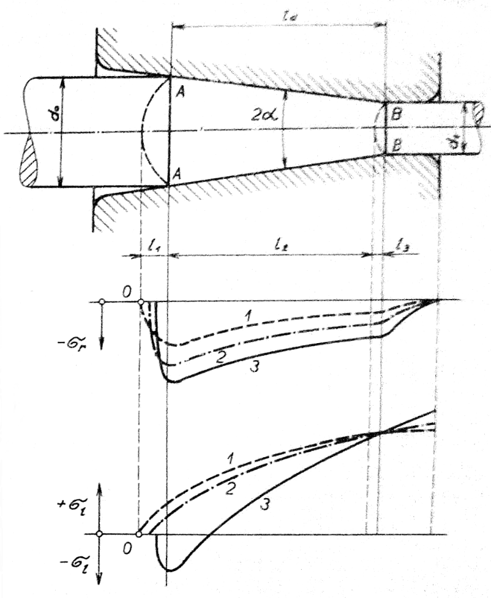
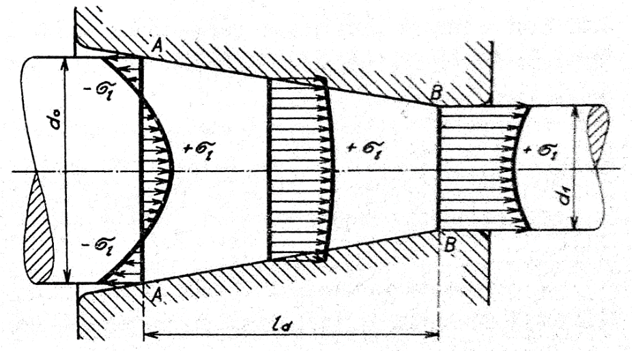

#### Rozdelenie napätia v pásme deformácie

Veľkosť pozdĺžnych i radiálnych napätí sa mení po dĺžke i po výške prierezu pásma deformácie. Tlakové radiálne napätia sú najväčšie v dotykovej vrstve materiálu a zmenšujú sa k osy tyče. V ose tyče majú najmenšiu veľkosť.

Pokiaľ skúmame ich priebeh po dĺžke pásma deformácie, musíme uvažovať skutočné pásmo, s omezujúcimi úsekmi $$l1$$ a $$l3$$ podľa obr. 259. Priebeh radiálnych napätí v pásme deformácie je zakreslený na obrázku 264. Krivka $$1$$ znázorňuje priebeh napätí $$\sigma_r$$ v osovej vrstve, krivka $$3$$ v povrchovej vrstve, ktorá je v priamom dotyku s prievlakom, krivka $$2$$ znázorňuje priebeh radiálnych napätí vo vrstve medzi povrchom a osou ťahanej tyče. Najväčšie hodnoty majú radiálne napätia v jednotlivých vrstvách na počiatku pásma deformácie. Smerom ku koncu sa ich veľkosti zmenšujú.

<figure><figcaption></figcaption></figure>

Obr. 264. Priebeh radiálnych a pozdĺžnych napätí v pásme deformácie

Na obr. 264 je tiež zakreslený priebeh pozdĺžnych napätí $$\sigma_1$$. Krivka $$1$$ znázorňuje tieto napätia v ose, krivka $$2$$ v medziľahlom vlákne, a krivka $$3$$ vo vlákne na povrchu ťahanej tyče. Vzhľadom k brzdiacim účinkom vonkajšieho trenia sú povrchové vlákna na počiatku pásma deformácie vystavené tlakovému napätiu a až ďalej od vstupného prierezu sa začína i v týchto vláknach prejavovať ťah, a tým aj predlžovanie okrajových vlákien.

Podľa diagramu ťahových napätí na obr 264. je možné zostrojiť schému rozloženia pozdĺžnych napätí $$\sigma_1$$ v jednotlivých priečnych prierezoch pásma deformácie. Schéma pozdĺžnych napätí v priečnych prierezoch je znázornený na obr.265.

<figure><figcaption></figcaption></figure>

Obr. 265. Priebeh pozdĺžnych napätí v priečnych rezoch pásma deformácie.

Nakreslený priebeh pozdĺžnych napätí má za následok, že sa tu môže porušiť súdržnosť materiálu. Vznikajú vnútorné trhliny ktoré sú známkou tkzv. „pretiahnutej tyče, alebo drôtu“. Popísane priebehy pozdĺžnych napätí sú tiež v súlade s priebehom rýchlosti deformácie v smere ťahania. Vnútorné vlákna sa v pásme deformácie predlžujú rýchlejšie ako okrajové vlákna. Z rozboru napätia v pásme deformácie je zrejmé, že ich rozloženie a veľkosť závisí na veľkosti trenie a na kužeľovitosti prievlaku a na polomere zaokrúhlenia prechodu kužeľovitej časti do časti valcovitej. Tieto geometrické podmienky majú vplyv na priebeh trajektórií pozdĺžnych a radiálnych napätí. V teórii sklzových čiar bolo odvodené, že veľkosť napätí závisí na uhle pootočenia trajektórie. Pri pozvoľnej a malej zmene smeru trajektórie pozdĺžných napätí budú tieto napätia malé. Preto je žiadúce, aby kužeľovitosť prievlaku bolo malé. Sklon povrchovej priamky k osy ťahania býva obvykle $\alpha = 5° až $10°.