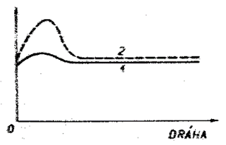

### Veľkosť úberu prierezu pre jeden priechod

Pri návrhoch technologických postupov ťahania za studena je nutné určiť maximálny možný úber prierezu pre jeden priechod. Veľkosť úberu závisí na spevnení ťahaného kovu, na veľkosti trenia a rýchlosti ťahania. Stupeň spevnenia sa určuje podľa medze klzu.\par
Prierez tyče pred ťahaním je $$U_0$$, po ťahaní $$U_1$$, medza klzu pred ťahaním $$\sigma_{K0}$$, po ťahaní $$\sigma_{K1}$$. Podmienkou je, aby sa tyč po výstupe z prievlaku nepredlžovala. Označme $$p$$ veľkosť pomernej ťažnej sily pripadajúcu na jednotku prierezu $$U_1$$, tj. $$p=\frac{P}{U_1}$$. Je to priemerná veľkosť ťahového napätia a platí pre ňu podmienka $$P\geq\sigma_{K1}$$. Pri ťahaní v prievlakoch s malou kužeľovitosťou (pre $$\alpha\leq10^\circ$$) môžeme predpokladať lineárnu závislosť medze klzu v rôznych priečnych prierezoch pásma deformácie na okamžitom stupni deformácie. Pretože ide o veľké deformácie, musí sa k ich vyjadrení použiť logaritmické deformácie. Potom je možné písať pre medzu klzu $$\sigma_{K1}$$ rovnicu.

$$
\begin{align}	
\label{eq:me_kl}
    \sigma_{K1}=\sigma_{KS}\frac{U_0}{U_1}
\end{align}
$$

Gde $\sigma{KS}$ je priemerná medza klzu v pásme deformácie a $\sigma_{KS}=\frac{1}{2}(\sigma_{K0}+\sigma_{K1})$\par
So zreteľom k pomernej ťažnej sile platí tento vzťah \ref{eq:pom_ts}.

$$
\begin{align}
\label{eq:pom_ts}
    p\leq\sigma_{K1}=\sigma_{KS}\ln{\frac{U_0}{U_1}}
\end{align}\
$$

Pre najväčšiu možnú pomerovú zmenu prierezu vychádza z predošlých vzťahov táto rovnica \ref{eq:pom_zm_prierez}.

$$
\begin{align}
\label{eq:pom_zm_prierez}
    q_{max}=(\ln{\frac{U_0}{U_1}})_{max}=\frac{2\frac{\sigma_{K1}}{\sigma_{K0}}}{1+\frac{\sigma_{K1}}{\sigma_{K0}}}
\end{align}\
$$

$$
\begin{wrapfigure}{1}{0.3\textwidth}
	\includegraphics[width=0.9\linewidth]{t_s_zac_tah.png}
    \caption{Pomerná ťažná sila na začiatku ťahania}
    \label{fig:taz_s_zac_tah}
\end{wrapfigure}
$$

Pomer $$\frac{\sigma_{K1}}{\sigma_{K)}}$$ je stupňom zpevnenia $Z_K$ podľa medze klzu, takže vrchnú rovnicu je možné písať aj v nasledujúcom tvare: $$q_{max}=\frac{2Z_K}{1+Z_K}$$

Odvodené rovnice sa vzťahujú na ustálený proces ťahania s konštantnou hodnotou pomernej ťažnej sily $$p$$. Na začiatku ťahania, pri zábere, je však pomerná sila väčšia ako pri ustálenom procese. Ide o dynamický účinok pri zábere, ktorý bude tým väčší, čím väčšia je rýchlosť ťahania. Časový  priebeh pomernej ťažnej sily $$p$$ je znázornený graficky na obr. 268. Krivka 1 platí pre malé a krivka 2 pre veľké rýchlosti ťahania. Pri veľkých rýchlostiach je pomerná ťažná sila pri záberu až dvakrát tak veľká ako pri ustálenom ťahaní. Preto majú moderné ťažné stolice regulovateľnú rýchlosť ťahania. Pri zábere sa ťahá s malou rýchlosťou, ktorá sa potom zväčšuje až na normálnu hodnotu ustáleného pochodu.

<figure><figcaption></figcaption></figure>

Obr. 268. Zmena pomeru ťažnej sily na začiatku ťahania.

