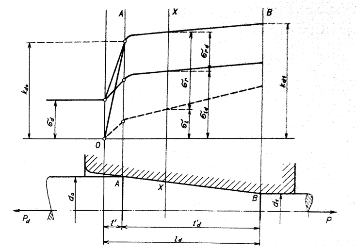

#### Vplyv protiťahu pri ťahaní

Pri ťahaní sa niekedy používa protiťah, ktorý pôsobí na zadný koniec ťahanej tyče v opačnom zmysle, ako účinok ťažnej sily. Týmto protiťahom sa v tyči vyvolávajú doplnkové pozdĺžne napätia $$\sigma_d$$.

Podľa rovnice : $$\sigma_1-(-\sigma_r)=\sigma_K$$; $$\sigma_1+\sigma_r=\sigma_K$$ sa súčet pozdĺžneho napätia $$\sigma_1$$ vyvolaného ťažnou silou $$P$$, a radiálneho napätia $$\sigma_r$$ rovná v každom mieste pásma deformácie medze klzu $$\sigma_K$$. Tento súčet napätia predstavuje deformačný odpor pri ťahaní $$k_d$$. Na počiatku pásma deformácie sa musí najskôr prekonať odpor proti pružným deformáciám. V tomto úseku $$l'$$ platí Hookov zákon. Deformačný odpor kd tu má lineárny priebeh obr: 266. V ďalšom úseku $$l_d'$$ sú už plastické deformácie. Tu sa prejavuje vplyv spevňovania materiálu. Spravidla sa pre jednoduchosť tiež predpokladá lineárna zmena deformačného odporu. Súhlasí to s predstavou o závislosti intenzity napätia, ktorá je mierou deformačného odporu. Ak neuvažujeme okolnosť, že vnútorné vlákna sa začínajú predlžovať už pred vstupným prierezom A-A pásma deformácie a že sú preto v nich už určité napätia $$\sigma_1$$ platí  schéma na obr. 266. Pre ktorýkoľvek bod v pásme deformácie. Na počiatku úseku $$l_d'$$ plastických deformácií má deformačný odpor veľkosť $$k_d0$$, na konci pásma odpor $$k_d1$$. V ľubovolnom reze $$X$$ je deformačný odpor 
$$  k_d\equiv\sigma_K=\sigma_1+\sigma_r$$
Z diagramu je zrejmé, že podiel pozdĺžneho napätia sa po dĺžke pásma deformácie zväčšuje a podiel radiálneho napätia zmenšuje. Ich súčet sa však vždy rovná okamžité medzi klzu . Ak pôsobí na zadný koniec tyče spätný ťah $$P_d$$, vyvolá sa v priečnom  priereze doplnkové ťahové napätie $$\sigma_d$$ . Pretože súčet pozdĺžnych a radiálnych napätí sa rovná medze klzu, zmenší sa tým podiel radiálneho napätia $$\sigma_{rd}=\sigma_K-(\sigma_1+\sigma_d)$$
Ak pôsobí na tyč zpätný ťah, priebeh napätia v pásme deformácie je schematicky znázornený na obr. 267. Z diagramu je zrejmé, že radiáne napätie $$\sigma_{rd}$$ v ľubovolnom priečnom reze $X - X$ je podstatne menšie ako radiálne napätie $\sigma_r$ bez protiťahu.

<figure><figcaption></figcaption></figure>

Obr. 267. Zmena napätia v pásme deformácie pri ťahaní s protiťahom

Na veľkosti radiálneho napätia na povrchu ťahanej tyče závisí veľkosť povrchových a tangenciálnych napätí, $$\tau_K$$ ktoré predstavujú trecie sily, $$\tau_K = \mu\cdot\sigma_T$$. Ak sa zmenší účinok doplnkových ťahových napätí $$\sigma_d$$ radiálne napätie, zmenšia sa trecie sily na dotykovej ploche prievlaku, a tým i jeho opotrebenie. V tomto je praktický význam ťahania s protiťahom. Ďalší význam protiťahu je v tom, že v ťahanej tyči sú hneď od počiatku pásma deformácie $$A - A$$$ len ťahové napätia, odstráni sa počiatočný úsek pásma deformácie s tlakovým pozdĺžnym napätím.

