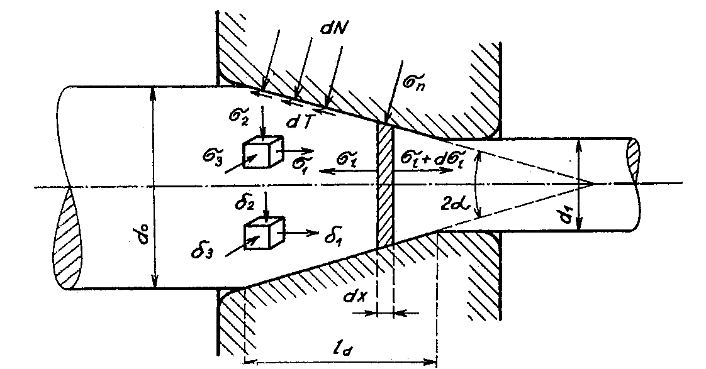
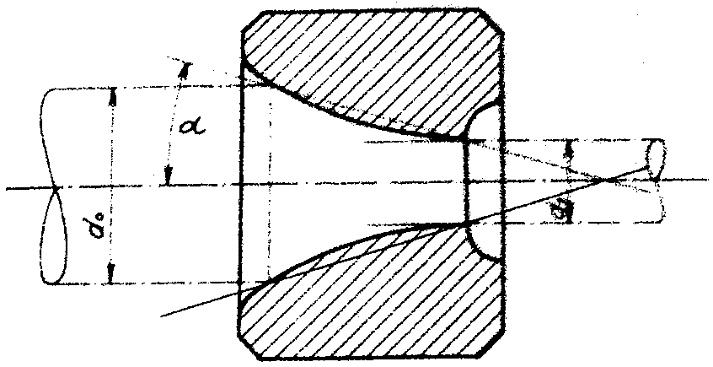

## Podstata a všeobecné znaky ťahania v prievlaku

Dostatočne veľké deformácie materiálu sú umožnené tým, že v pevnom prie-vlaku je vyvolaný trojosový stav napätosti s tlakovými napätiami v priečnom smere. U výrobku kruhového prierezu je to všestranný radiálny tlak. Dostatočne veľký radiálny tlak je podmienkou pre vyvolanie požadovaných veľkých plastických deformácií a rozmerových zmien drôtu, tyče, alebo trubky. Avšak najväčšie hlavné napätie je ťahové napätie v pozdĺžnom smere, vyvolané účinkom ťažnej sily. Tým v schéme troj-osej napätosti považuje napätie v ťahu, čo obmedzuje veľkosť plastickej deformácie pri jednom priechode prievlakom. Ďalšie obmedzenie je spôsobené spevnením kovu pri ťahaní za studena. Preto sú väčšinou deformácie na je jeden priechod, to znamená na jednu technologickú operáciu, menšie ako pri iných operáciách tvárnenia kde prevládajú tlakové napätia. Koeficient predĺženia nepresahuje u oceliach hodnotu 1,75, čo odpovedá zmenšení prierezu asi o 43\%. Pri ťahaní sa spravidla pri každom priechode kov spevní  a jeho deformačná schopnosť sa tak vyčerpá, že pre ďalšie ťahanie je nutné predošlé vyžíhanie polotovaru. Ak sa však obmedzí nepriaznivý vplyv vonkajšieho trenia vhodnou úpravou povrchu polotovaru, napríklad fosfátovaním, je možné ťahať bez medzi-žíhania i niekoľkokrát po sebe.

<figure><figcaption></figcaption></figure>

Obr. 256. Podstata ťahania v prievlaku

 Prievlaky majú základný kužeľovitý tvar, obr. 256, kde je schéma ťahania plnej tyče. Kužeľovitá časť prievlaku prechádza v krátku valcovitú pracovnú časť, ktorá má funkciu kalibračnú a upravuje presné rozmery ťahaného výrobku. Prievlaky takéhoto základného tvaru sa používajú pre ťahanie tyčí a trubiek. Pre ťahanie drôtu sa používajú tiež prievlaky, ktorých pracovná plocha má krivkový obrys obr.257. 

<figure><figcaption></figcaption></figure>

Obr. 257. Prievlak s kryvkovou pracovnou plochou.

Prievlaky sa vyrábajú oceľové kalené, alebo sú tvrdo chrómované, s~dokonale vyleštenou pracovnou plochou. Používajú sa tiež prievlaky so spekaných karbidov, a pre ťahanie drôtu prievlaky diamantové. Takéto prevedenie prievlakov značne zmenšuje koeficient vonkajšieho trenia , ktorý neprevyšuje hodnotu $$\mu = 0,15$$. Pri prievlakoch s vyleštenou pracovnou plochou býva $$\mu< 0,15$$.\par
Aby sa koeficient trenia zmenšil, musia sa pracovné plochy prievlaku mazať. Akosť maziva má podstatný vplyv na veľkosť koeficientu trenia. V niektorých prípadoch, napríklad pri ťahaní trubiek z legovaných ocelí, opatruje sa povrch trubiek povlakom z medi, alebo z olova. Na veľkosť koeficientu trenia má tiež veľký vplyv akosť pracovných plôch prievlaku. Ďalej koeficient trenia závisí na rýchlosti ťahania a na zahriatí materiálu teplom, ktoré vzniká pri tvárnení za studena.\par
Východisková tyč o priemere $$d_0$$ sa účinkom ťažnej sily $P$ preťahuje prievlakom, ktorého priemer $$d_1$$ určuje rozmer tyče po ťahaní. Na kužeľovom povrchu ťažnej tyče v pásme deformácie pôsobí elementárne normálové tlaky $dN$ a elementárne trecie sily $$dT = \mu .dN$$. Tieto sily sú rozhodujúce pre celkový stav napätosti v pásme deformácie. Normálne tlaky a trecie sily vo valcovej časti prievlaku sú podstatne menšie a nemajú vplyv na priebeh deformácie vo vlastnom kužeľovitom pásme. Na ľubovoľný priečny element materiálu v pásmu deformácie, ktorý má nekonečne malú hrúbku $dx$, pôsobí na kužeľovitom obryse normálové napätie $$\sigma_n$$  a dotyčnicové napätie $$\tau = \mu . \sigma_n$$. V priečnych rezoch pôsobí pozdĺžne ťahové napätie $$\sigma_1$$ a $$(\sigma_1 + d\sigma_1)$$, ktoré nieje v priečnom priereze rozdelené rovnomerne. Ďalšie napätie pôsobí v obvodovom smere. Je to tlakové napätie $$\sigma_0$$.\par
V ľubovoľnom bode kužeľovitej časti pásma deformácie je trojosí stav napätosti vyznačený týmito hlavnými napätiami:
1. Absolútne najväčším napätím $$\sigma_1$$ ,ktoré je napätím ťahovým, je im pozdĺžne ťahové napätie $\sigma_1$
2. Stredným napätím $$\sigma_2$$ ,ktoré pôsobí v radiálnom smere a je napätím tlakovým
3. Absolútne najmenším napätím $$\sigma_3$$ ,ktoré je taktiež tlakovým napätím a pôsobí v obvodovom smere

Tomuto trojosovému stavu napätostí zodpovedá trojosí stav hlavných deformácií $$+\epsilon_1$$, $$ -\epsilon_2$$, $$-\epsilon_3$$. Schéma napätí a deformácie sú znázornené na obr. 256
Priebeh deformácie je určený geometrickými podmienkami ťahania, to znamená priemerom východiskovej tyče $$d_0$$, priemerom prievlaku $$d_1$$ a jeho kužeľovitosti $$2\alpha$$. Pri riešení úlohy sa uplatní iba zákon stálosti objemu. Zákon najmenšieho odporu sa tu neuplatní, lebo tvar a rozmery výrobku sú vopred určené tvarom a rozmermi prievlaku.

