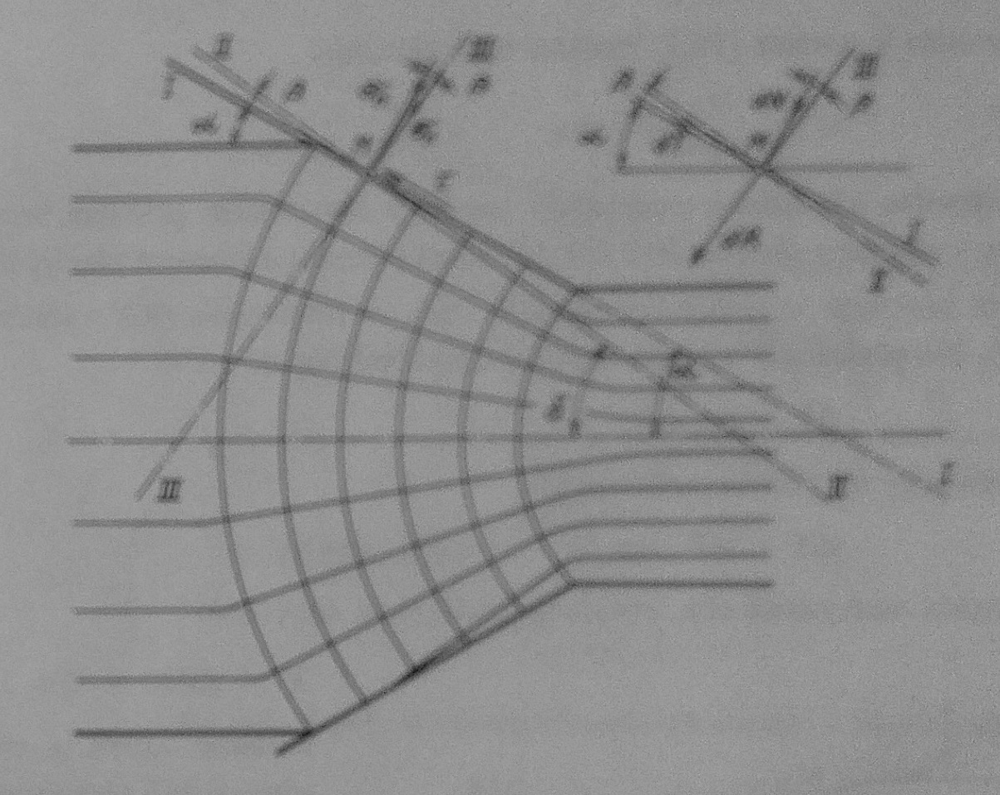
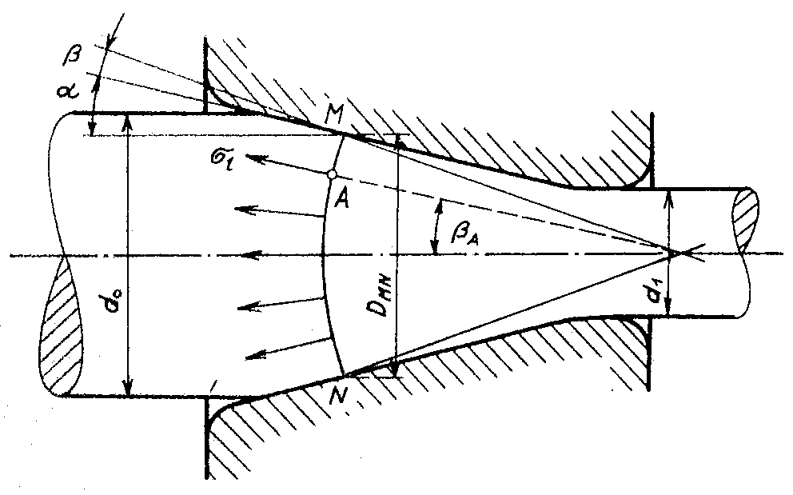
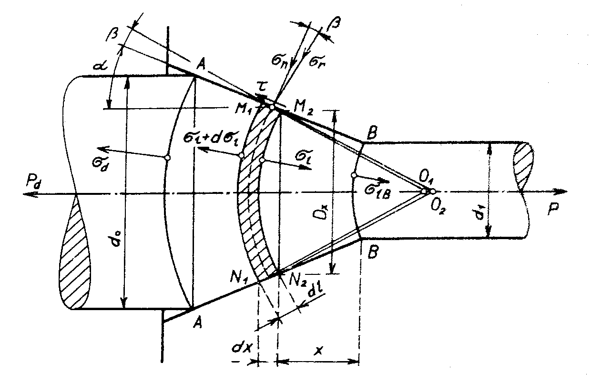
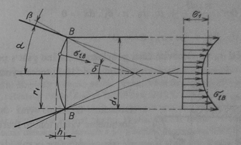

### Napätia a sily v kužeľovitej časti prievlaku

<figure><figcaption></figcaption></figure>

Obr. 269. Trajektórie normálových napätí v kužeľovej časti prievlaku

Na elementárnej dotykovej ploche pôsobí elementárny normálový tlak $$dN$$, ktorý je súčiniteľom normálového napätia $$\sigma_n$$ o velkosti $$dU$$:

\begin{align}
\label{eq:norm_tlak}
    dN=\sigma_n.dU
\end{align}\

Tento tlak vyvolá elementárnu treciu silu $$dT$$:

\begin{align}
\label{eq:trecia_sila}
    dT=\mu.dN = \mu.\sigma_m.dU
\end{align}\

Výslednica týchto síl $$dR$$ zviera s normálou k ploche $$dU$$ uhol trenia $$\beta$$ a má veľkosť danú rovnicou \ref{eq:vys_sil_R} obr \ref

Spadá do smeru $$III-III$$ radiálneho napätia $$\sigma_X$$. Je to dotyčnica k ortogonalnej trajektórii hlabného radiálneho napätia v bode $$M$$. Smernice $$II-II$$, ktorá je k nej kolmá a je trajektóriou pozdĺžnych napätí vychádzajúcich z bodu M.
Hlavné normálové napätie $$\sigma_r$$ sa stanoví ako podiel elementárnej sily $$dR$$ a priemetu elementárnej plôšky $$dU$$ do smeru kolmého na $$dR$$:

\begin{align}
\label{eq:norm_nap_r}
    \sigma_r=\frac{dR}{dU.\cos{\beta}}=\sigma_n.\frac{dU.\sqrt{1+\mu^2}}{dU.\cos{\beta}}=\sigma_n.\frac{\sqrt{1+\tan^2{\beta}}}{\cos{\beta}}
\end{align}\

Po úprave vychádza tento vzťah:

\begin{align}
\label{eq:norm_nap_r_upr}
    \sigma_r=\frac{\sigma_n}{\cos^2{\beta}}
\end{align}\

S prihliadnutím k rovnici \ref{eq:podm_plast} vychádza táto závislosť:

\begin{align}
\label{eq:zavislost_napatia}
    \sigma_1+\frac{\sigma_n}{\cos^2{\beta}}=\sigma_K
\end{align}\par

Pri výpočte výslednice pozdĺžnych napätí v ľubovolnom priečnom reze $$MN$$ pásma deformácie vychádzame z elementárnej sily $$dP$$, ktorá pôsobí na element plochy guľového vrchlíku, ktorého obrysom v pozdĺžnom reze je trajektória  $$MN$$ radiálnych napätí $$\sigma_r$$ obr 270. Na ploche $$dU$$ v bode $$A$$ pôsobí pozdĺžne napätie $$\sigma_1$$:

<figure><figcaption></figcaption></figure>

Obr. 270. Pozdĺžne napätia v priečnom priereze pásma deformácie

\begin{align}
\label{eq:pozdlzne_napatie}
    dP=\sigma_1.dU
\end{align}\

Priemet tejto sily do vodorovného smeru

\begin{align}
\label{eq:priemet_sily_do_vod_smeru}
    dX=dP.\cos\beta_A=\sigma_1.dU.\cos\beta_A
\end{align}\

Výsledná vodorovná sila, vyvolaná pozdĺžnymi napätiami:
\begin{align}
\label{eq:vodorovna_sila_vyv_napatiamy}
    X=\sum{dX}=\sum{\sigma_1}.dU.\cos{\sigma_A}       
\end{align}\

Pozdĺžne napätia$$\sigma_1$$ má po celej trajektórii $$MN$$ rovnakú veľkosť. Potom je možné písať túto rovnicu:

\begin{align}
\label{eq:vodorovna_sila_vyv_napatiamy_upravena}
    X=\sigma_1.\sum{dU}.\cos{\beta_A}       
\end{align}\

Výraz $$\sum{dU}.\cos\beta_A$$ je priemet plochy vrchlíku do smeru kolmého k smeru ťahania. Je to plocha kruhu o priemere $$D_{MN}$$ rovného úsečke $$MN$$:

\begin{align}
\label{eq:vodorovna_sila_vyv_napatiamy_upravena_final}
    X=\sigma_1.\frac{\pi.D^2_{MN}}{4}    
\end{align}\par

Pre veľkosť ťažnej sily je rozhodujúca vodorovná sila vo výstupnom priereze z pásma deformácie. Toto pásmo je podla obr. 271 ohraničené dvomi guľovými vrchlíkmi, ktorých obrys tvoria trajektórie $$A-A$$ a $$B-B$$.Uvažujem zložitejší prípad ťahania s protiťahom $$P_d$$. Tento protiťah vyvolá na trajektórii $$A-A$$ pozdĺžne ťahové napätia $$\sigma_d$$. Vlastná ťažná sila sa vo výstupnom priečnom priereze $$B-B$$ rovná súčinu plochy tyče po ťahaní $$U_1$$ a stredného pozdĺžneho napätia $$\sigma_1:P=U_1.\sigma_1$$. Táto sila sa potom ešte zväčší o odpor trenia vo valcovitej kalibračnej časti prievlaku.

<figure><figcaption></figcaption></figure>

Obr. 271. Napätie na element objemu materiálu v pásme deformácie

Pre riešenie úlohy vytkneme v pásme deformácie elementárny objem o hrúbke $$dl=\frac{dx}{\cos{\alpha}}$$. Tento elementárny objem je obmedzený dvoma nekonečne blízkymi guľovými plochami, ktorých obrysy zvierajú s kužeľovým obrysom prievlaku uhol ($$90\deg-\beta$$), uhol $$\beta$$ je uhol vonkajšieho trenia. Predĺžená trajektória pozdĺžnych napätí vychádzajúcich s priesečníku oboch obrysov elementárneho objemu pásma deformácie s kužeľovým obrysom prievlaku pretínajú os ťahania v bodoch $$O_1$$ a $$O_2$$. Na elementárnej ploche o dĺžke $$dl$$ pôsobia normálové napätia $$\sigma_n$$ a dotyčnicové napätia $$\tau=\mu.\sigma_n$$. Výsledný vektor zložiek $$\sigma_n$$ a $$\tau$$ tvoria vektor napätí $$\sigma_\tau$$ ktorého smer sa s prijateľnou približnosťou zhoduje zo smerom dotyčníc k trajektóriám $$M_1N_1$$ a $$M_2N_2$$ z okrajových bodov šírky $$dl$$.\par

Pokiaľ vytkneme tento elementárny objem pásma deformácie, musíme účinok susediacich vrstiev materiálu nahradiť napätím $$\sigma_1$$ a $$(\sigma+d\sigma_1)$$. Označme dotyčnicu $$M_2N_2$$ ako priemer $$Dx$$. Je to priemer priečneho prierezu $$U_x=\frac{\pi.D^2_x}{4}$$. S prihliadnutím k rovnici \ref{eq:zavislost_napatia} až \ref{eq:vodorovna_sila_vyv_napatiamy_upravena_final} môžeme písať takúto diferenciálnu rovnicu rovnováhy napätí pôsobiacich vo vodorovnom smere na elementárny objem pásma deformácie:

\begin{align}
\label{eq:diferencialna_rovnica_rov_nap}
   U_x.\sigma_1+d(U_x.\sigma_1)-U_x.\sigma_1+\pi.D_x.\frac{dx}{\cos{\alpha}}.\sigma_n(\sin{\alpha+\mu.\cos{\alpha}})=0 
\end{align}

pri čom:

\begin{align}
\label{eq:diferencialna_rovnica_rov_nap_upr}
   x=\frac{D_x-d_1}{2\tan{\alpha}};dx=\frac{dD_x}{2\tan{\alpha}}\\
   d(U_x.\sigma_1)=d\left(\frac{\pi.D^2_x}{4}.\sigma_1\right)=\frac{\pi}{4}(D^2_x.d\sigma_1+2\sigma_1.D_x.dD_x)\nonumber
\end{align}

Pokiaľ túto rovnicu vydelíme výrazom $$\frac{\pi.D^2_x}{4}$$, dostávame po úprave vzťah:

\begin{align}
\label{eq:rovnica_10_15}
    d\sigma_1+2\sigma_1.\frac{dD_x}{D_x}+\frac{2.dD_x}{D_x}.\sigma_n.(1+\mu.\tan\alpha)=0
\end{align}

Podmienku plastičnosti podľa rovnice \ref{eq:podm_plast} je možné tiež písať v tvare:

\begin{align}
    \sigma_n=(\sigma_K-\sigma_1).\cos^2\beta\nonumber
\end{align}

Z tejto rovnice a z rovnice \ref{eq:rovnica_10_15} vychádza pre pozdĺžne napätie diferenciálna rovnica:

\begin{align}
\label{eq:rovnica_10_16}
    \frac{d\sigma_1}{(\sigma_1-\sigma_K).\cos^2{\beta}.(1+\mu.\cos\alpha)-\sigma_1}=\frac{2.dD_x}{D_x}
\end{align}

Pre zjednodušenie označme konštantný výraz $$[\cos^2{\beta}(1+\mu.\cos\alpha)-1]$$ ako veličinu $$a$$.
Potom je možné rovnicu \ref{eq:rovnica_10_16} prepísať do tvaru:

\begin{align}
\label{eq:rovnica_10_17}
    \frac{d\sigma_1}{\sigma_1-\sigma_K.\frac{a+1}{a}}=2a.\frac{dD_x}{Dx}
\end{align}

Integrovaním dostávame rovnicu:

\begin{align}
    \label{eq:rovnica_10_18}
    \ln\left(\sigma_1-\sigma_K.\frac{a+1}{a}\right)=2a.\ln{D_x}+\ln{C}
\end{align}

Logaritmus integračnej konštanty $$C$$ je stanovený z medznej podmienky, že pri $$D_x=d_0$$, to jest v reze $$A-A$$, je $$\sigma_1=\sigma_d$$:

\begin{align}
    \label{eq:rovnica_10_19}
    \ln\left(\sigma_1-\sigma_K.\frac{a+1}{a}\right)=2a.\ln{D_0}+\ln{C}\\
    \ln C=\frac{\sigma_d-\sigma_K.\frac{a+1}{a}}{d_0^{2a}}\nonumber
\end{align}

Po dosadení do výrazu \ref{eq:rovnica_10_18} vychádza rovnica tohoto tvaru:

\begin{align}
    \ln\left(\sigma_1-\sigma_K.\frac{a+1}{a}\right)=2a.\ln{D_x}+\ln{\frac{\sigma_d-\sigma_K.\frac{a+1}{a}}{d_0^{2a}}}\nonumber
\end{align}

Vo výstupnom priereze $$B-B$$ je podľa tejto rovnice možné písať výraz pre poz dĺžne napätie $$\sigma_1B$$:

\begin{align}
    \label{eq:rovnica_10_20}
    \sigma_{1B}-\sigma_k.\frac{a+1}{a}=\left(\sigma_d-\sigma_K.\frac{a+1}{a}\right).\left(\frac{d_0}{d_1} \right)^{2a}
\end{align}

Z tohto výrazu vychádza konečný tvar rovnice pre pozdĺžne napätia vo výstupnom priereze $$B-B$$ pásma deformácie:

\begin{align}
    \label{eq:rovnica_10_21}
    \sigma_{1B}=\sigma_K.\frac{a+1}{a}\left[1-\left(\frac{d_0}{d_1}\right)^{2a}\right]+\sigma_d.\left(\frac{d_0}{d_1}\right)^{2a}
\end{align}

Výsledná ťažná sile v tomto priereze pásma deformácie sa musí počítať ako súčet elementárnych síl $$dP$$, pôsobiacich na elementárnej ploche $$dU_1$$ výstupného prierezu, pretože vodorovné zložky napätia $$\sigma_{1B}$$ nie sú v tomto priereze rozdelené rovnomerne. Napätia $$\sigma_{1B}$$ sú kolmé na trejektóriu $$B-B$$. Podľa obr. 272 sú skutočné pozdĺžne napätia rozdelené v priečnom priereze podľa nejakej krivky.

<figure><figcaption></figcaption></figure>

Obr. 272. Napätie vo výstupnom priereze pásma deformácie

V ľubovolnom bode trejaktórie $$B-B$$ zviera  napätie $$\sigma_{1B}$$ s vodorovnou osou ťahanie uhol $$\delta$$, ktorý sa mení od hodnoty $$\delta=0$$ do $$\delta=(\alpha+\beta)$$. Výsledná ťažná sila

\begin{align}
    P=\sum{dP}=\sum\sigma_{1B}.dU_{B}=\sigma_{1B}.U_B\nonumber
\end{align}

pričom $$U_B$$ je plocha guľového vrchlíku $$B-B$$. Podľa obrázku 272 platí medzi plochou vrchlíku a priečnou plochou kruhového prierezu $$B--B$$ tento vzťah:

\begin{align}
    \frac{U_B}{U_1}=\frac{\pi(r_1^2+h^2)}{\pi.r_1^2}=1+\tan^2\frac{\alpha+\beta}{2}=\frac{1}{\cos^2{\frac{\alpha+\beta}{2}}}\nonumber
\end{align}

Za použití týchto vzťahov je možné vypočítať priemernú hodnotu pozdĺžneho napätia vo vstupnom priereze $$B-B$$:

\begin{align}
    \label{priem_hodn_poz_nap_1022}
    \sigma_1=\frac{1}{\cos{\frac{\alpha+\beta}{2}}}.\sigma_{1B}\\
    \sigma_1=\frac{1}{\cos{\frac{\alpha+\beta}{2}}}.\left(\sigma_K.\frac{a+1}{a}\left[1-\left(\frac{d_0}{d_1}\right)^{2a}\right]+\sigma_d.\left(\frac{d_0}{d_1}\right)^{2a}\right)\nonumber
\end{align}

Výsledná ťažná sila potrebná na deformáciu v kužeľovej časti prievlaku je potom rovná 

\begin{align}
    P=\frac{\pi.d_1^2}{4}.\sigma_1    \nonumber
\end{align}

Celková ťažná sila sa ešte zväčší o odpor trenia vo valcovej časti prievlaku.

