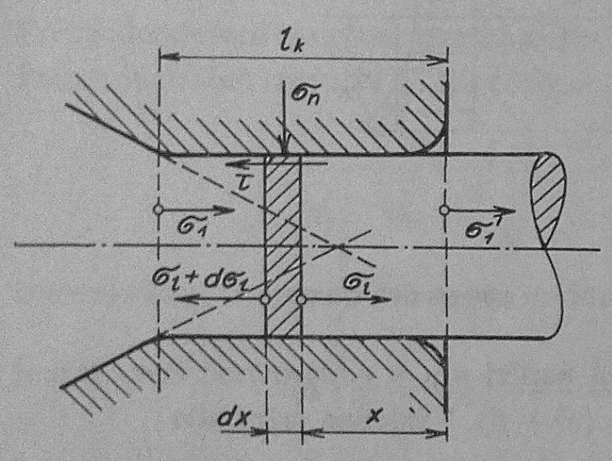

# Napätie a sily vo valcovej časti prievlaku

Vytkneme vo valcovej časti prievlaku element objemu o hrúbke $$dx$$ obr.273. Na tento elementárny objem pôsobí normálové napätie $$\sigma_n$$ a pozdĺžne napätie $$\sigma$$ a $$(\sigma_1+d\sigma_1)$$. Rovnica rovnováhy napätia má potom nasledovný tvar:

<figure><figcaption></figcaption></figure>

Obr. 273. Napätie vo valcovej časti prievlaku

$$
\begin{align}
    d\sigma_1.\frac{\pi.d_1^2}{4}+\mu.\sigma_n.\pi.d_1.dx=0\\
    d_1d\sigma_1+4\mu.\sigma_n.dx=0
\tag{10.23}
\end{align}
$$

Pre normálové napätie $$\sigma_n$$ vo valcovej časti prievlaku je možné písať pri dodržaní podmienky plastičnosti tento výraz: $$\sigma_n=\sigma_K-\sigma_1$$ Ak tento výraz dosadíme do rovnice (10.23), dostaneme vzťah tvaru:$$d_1.d\sigma_1+4\mu.(\sigma_K-\sigma_1).dx=00$$ Po úprave a integrovaní vychádza:

$$
\begin{align}
    4.\mu.x=d_1.\ln{C(\sigma_k-\sigma_1)}\nonumber\\
    x=\ln{\left[C(\sigma_K-\sigma_1)^{\frac{d_1}{4_\mu}}\right]}\nonumber\\
    e^x=C.(\sigma_K-\sigma_1)^{\frac{d_1}{4\mu}}
    \tag{10.24}
\end{align}
$$

Veľkosť integračnej konštanty $$C$$ je možné určiť z medznej podmienky tak, že pri: $$x=l_k$$ je $$\sigma_1=\sigma_1$$:

$$
\begin{align}
C=e^{1_K}.(\sigma_K-\sigma_1)^{-\frac{d_1}{4\mu}}\nonumber
\end{align}
$$

Pri $$x=0$$ je $$\sigma_1=\acute{\sigma_1}$$. Je to pozdĺžne napätie na konci kalibračnej valcovitej časti prievlaku, zväčšenej oproti napätiu na začiatku tejto časti o odpor vonkajšieho trenia:

$$
\begin{align}
    \acute{\sigma_1}=\sigma_K-e^{-\frac{4\mu.1_K}{d_1}}.(\sigma_K-\sigma_1)\nonumber
\end{align}
$$

Z tohoto vychádza pre pozdĺžne napätie v kalibračnej časti pripadajúce len na prekonanie trenie takáto rovnica:

$$
\begin{align}
\tag{10.25}
    \sigma1_K=\acute{\sigma_1}-\sigma_1\nonumber\\
    \sigma1_K=\sigma_K-(\sigma_K-\sigma_1).e^{-\frac{4\mu.1_K}{d_1}}-\sigma_1
\end{align}
$$

Z tejto rovnice je zrejmé, že pozdĺžne napätie $$\sigma_{1K}$$ v kalibračnej časti prievlaku vzrastá s jeho dĺžkou $l_K$ a s klesajúcou hodnotou napätia $\sigma_1$ na konci kužeľovej časti prievlaku.